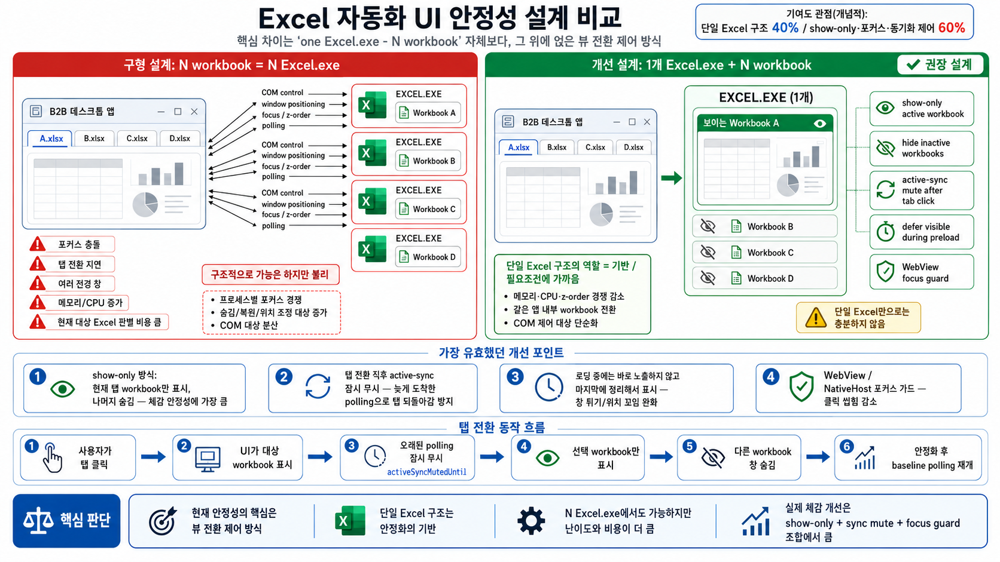

# B2B 스마트 빌링 에이전트

LG U+ 사내용 Excel 자동화 데스크톱 앱입니다. 엑셀 입력 파일과 출력 템플릿을 올린 뒤, AI가 만든 Excel 스킬(라이브 Python COM 또는 VBA)을 단계별 파이프라인으로 **실제로 떠 있는 Excel 워크북**에 적용해 결과 xlsx를 만듭니다. 만들어 둔 스킬은 zip으로 저장해 다음 달 파일에 그대로 다시 돌릴 수 있습니다(스킬 실행기).

구성은 세 덩어리입니다.

- **Python 백엔드** — `serve_b2b.py`. 로컬 HTTP 서버로 정적 파일 + `/api/*` + `/v1/*`(사내 ixi/vLLM OpenAI-compatible 프록시)을 담당합니다. Excel COM 제어와 스킬용 `ctx` 헬퍼 구현이 전부 여기 있습니다.
- **브라우저 UI** — `index.html` + `scripts/*.js`. 스킬 생성기·실행기 SPA.
- **C# 네이티브 셸** — `native_host/NativeHost.cs`. WebView2로 위 UI를 띄우고 오른쪽에 실제 Excel 창을 미러로 붙입니다. 배포본은 PyInstaller onefile(`B2B_Server.exe`)과 이 셸을 묶은 단일 EXE입니다.

> **제품명**: 2026-09-08부터 **B2B 스마트 빌링 에이전트**(구 AX-Cell)입니다. 단, 지시에 따라 두 곳은 `AX-Cell` 을 그대로 둡니다 — ① 스킬 생성기 U+ 로고 옆 제목(`index.html` 의 `#page-title`) ② 좌측 메뉴 그룹 라벨. 내부 식별자(`AXCellScheduler`, `axcell.ico`, 단일 EXE 컴파일 출력명 `AX-Cell.exe`)도 바꾸지 않았습니다.

## 화면 구성

| 화면 | 진입 | 하는 일 |
|---|---|---|
| **스킬 생성기** (`data-page="generator"`) | 기본 화면 | 파일 업로드 → 채팅으로 작업 지시 → AI가 스킬 단계 생성 → 적용/전체실행. 오른쪽은 실제 Excel 미러 |
| **스킬 실행기** (`data-page="runner"`) | 좌측 메뉴 | 저장한 스킬 zip을 올려 다른 달 파일에 그대로 실행. 결과는 파일로 출력(`output/`)하고, [결과편집]으로 라이브에 불러와 이어서 손볼 수 있습니다 |
| **관리 대시보드** (`dashboard.html`) | F9 설정 창 → `📊 관리 대시보드` (새 창) | 보안망 수집 서버에 쌓인 사용 기록(사용자·조직·세션·오류·LLM 토큰) 조회 |
| AX-Trace · E2E 작업 등록 | 좌측 메뉴 | 준비 중. 항상 보이지만 "Coming soon" 반투명 블락으로 덮여 있고, **F6** 으로 해제/복귀합니다 |

## 개발 시작하기

포맷한 PC에서 `git clone` 직후 순서입니다.

### 1. 준비물

- Windows x64 + **데스크톱 Excel 설치**(스킬은 실제 Excel COM에 붙습니다)
- Python 3.10+
- `python -m pip install pywin32 openpyxl psutil`
  - 세 패키지는 `serve_b2b.py` 상단에서 try/except로 감싼 optional import입니다. 없어도 서버는 뜨지만 Excel 관련 기능이 **조용히 꺼집니다**. `pywin32`(=`win32com`/`pythoncom`)가 없으면 스킬 실행이 아예 안 됩니다.
  - `psutil` 은 좀비 Excel 정리와 부하 샘플러용입니다.
- Node.js는 **선택** — 백엔드 파이프라인 워커(`scripts/backend-pipeline-worker.js`)와 EXE 빌드에만 씁니다(`B2B_DISABLE_NODE_WORKER=1` 로 워커를 끌 수 있습니다).
- `.NET Framework 4.x` 의 `csc.exe` — 네이티브 셸을 컴파일할 때만 필요합니다(Windows 기본 포함).

확인은 `http://127.0.0.1:8090/api/backend/health` 에서 `openpyxl` / `excelCom` / `node` 가 각각 true인지로 합니다.

### 2. 서버만 띄워 브라우저에서 열기 (가장 빠른 확인)

```bat
python serve_b2b.py
```

→ 브라우저에서 `http://127.0.0.1:8090/index.html`

`python launch_b2b.py`(= `start_b2b.bat`)를 쓰면 서버를 띄우고 브라우저까지 열어 줍니다. 포트 기본값은 `8090`(`B2B_PORT`), 사용 중이면 `18090`~`18095`로 자동 fallback 합니다.

> 브라우저 직접 실행은 UI/로직 확인용입니다. Excel 미러가 오른쪽 패널에 붙는 **정식 경로는 네이티브 셸**이므로, 실제 사용 흐름을 재현할 때는 아래를 씁니다.

### 3. 정식 경로 — 네이티브 셸

```bat
start_b2b_native.bat
```

처음 실행하면 WebView2 패키지(NuGet)를 받아 C# 호스트를 자동 컴파일합니다. 폴더에 `B2B_Server.exe` 가 없으면 호스트가 `python serve_b2b.py` 로 서버를 띄우므로, 빌드하지 않고도 배포본과 같은 경로로 돌아갑니다. (반대로 **폴더에 낡은 `B2B_Server.exe` 가 있으면 소스를 고쳐도 그 exe가 뜹니다** — "고쳤는데 앱은 그대로"의 단골 원인.)

| 고친 것 | 필요한 것 |
|---|---|
| `scripts/*.js` · `styles/*.css` · `index.html` · `dashboard.html` | 화면 새로고침(F5 = 작업 상태 유지 소프트 리프레시) |
| `serve_b2b.py` 등 파이썬 | 서버 재시작 |
| `native_host/NativeHost.cs` | 재컴파일 (`native_host/build_native_host.ps1`) |

무엇을 고쳤을 때 무엇이 필요한지는 `tools/dev_run.ps1` 이 판단해 알려 줍니다.

### 4. AI 서버

기본 모델은 사내 ixi `Qwen3.6-27B-FP8` 이고, 화면의 모든 LLM 호출(설계 채팅·AI 도움·대시보드 질문)은 로컬 `/v1/*` 프록시를 지나 `B2B_VLLM_BASE` 로 나갑니다. F9 개발자 모드에서 Claude provider로 바꿔 테스트할 수 있습니다. Claude 키는 브라우저 `localStorage`, 또는 gitignore된 `keys.local.json`(`{"anthropicApiKey": "..."}`)에 두고 F9 의 `[저장된 키 불러오기]`(`/api/local-keys`)로 읽습니다.

## 핵심 파일 지도

### 백엔드 (Python)

| 파일 | 역할 |
|---|---|
| `serve_b2b.py` | 전부의 중심(약 2.3만 줄). HTTP 라우팅, Excel COM 세션 관리, **`PythonComSkillContext`(= 스킬이 쓰는 `ctx` API 68개)**, `_python_com_static_check`(AST 정적 게이트), `_run_python_on_session_impl` / `_run_vba_on_session_impl` / `_run_vba_pipeline_on_session_impl`(격리 파이프라인), `/v1` 프록시 + LLM 토큰 계측, 시스템 프롬프트 일부. **UTF-8 BOM 유지 필수** |
| `launch_b2b.py` | 런처. **버전의 단일 진실 `CURRENT_VERSION`**(현재 `0.8.4`). 프로즌 exe의 진입점이기도 하므로, 시작 시 1회 작업은 `serve_b2b.__main__` 이 아니라 `start_runtime_maintenance_threads` 에 넣어야 배포본에서도 돕니다. **UTF-8 BOM 유지 필수** |
| `log_sync.py` | 로그·자동백업 스킬을 보안망 수집 서버로 조금씩 전송. `whoami /fqdn` 파싱(`parse_fqdn_org` → 이름·마당아이디·팀·조직경로)도 여기 |
| `log_dash.py` | 관리 대시보드용 수집 서버 프록시(`/api/logdash/*` → 수집 서버 `/v1/admin/*`). `ALLOWED_PATHS` 화이트리스트 |
| `secure_doc.py` | 문서보안(AIP/DRM) 해제·재적용 |
| `record_service.py` · `native_macro_recorder.py` | F10 엑셀 작업 녹화 → 스킬 단계 역추적 |
| `b2b_scheduler.py` · `b2b_telemetry.py` | E2E 작업 등록(스케줄) 서버측 / 스킬 실행 관측 로그(`telemetry_preview.jsonl`). 둘 다 독립 애드온이라 없어도 본체가 돕니다 |

### 프런트 (브라우저)

| 파일 | 역할 |
|---|---|
| `index.html` | SPA 셸. **script 로딩 순서에 의존**합니다. `scripts/fkey-guard.js` 는 반드시 **첫 번째** 스크립트여야 합니다(capture 리스너 등록 순서가 곧 차단 능력) |
| `dashboard.html` | 관리 대시보드(단일 파일, 차트·필터·AI에게 묻기 포함) |
| `assist.html` | AI 도움 팝업을 네이티브 별창으로 띄울 때의 페이지 |
| `scripts/pipeline.js` | 스킬 파이프라인의 심장. 단계 적용/재적용/토글/삭제, 전체실행·이어실행, 스냅샷·빠른 복구, `pipelineStepLiveLanguage`(엔진 라우팅), 격리 파이프라인 호출 |
| `scripts/chat-ui.js` | 설계 채팅 UI + 적용 전 클라이언트 1차 게이트(`pythonComStaticSafetyFailures`, `validateAssistantCodeBeforeApply`) |
| `scripts/file-schema.js` | LLM에 넘기는 파일 스키마 + 시스템 프롬프트(`PYTHON_COM_SYSTEM_PROMPT`, VBA 프롬프트, 라우팅 규칙) |
| `scripts/llm-api.js` | LLM 호출·히스토리 윈도우 |
| `scripts/excel-mirror.js` | 실제 Excel 창 미러 제어(표시 대상 전환, 선택 폴링, 수식 표시줄) |
| `scripts/assist-*.js` | **AI 도움**(F11) — `assist-core`(오케스트레이터), `assist-tools`(읽기 전용 도구만), `assist-llm`(설계 채팅과 격리된 배관), `assist-guard`(액션 파서/가드), `assist-report`(이슈 제보 zip), `assist-ui`(떠 있는 팝업) |
| `scripts/fkey-guard.js` | F키 접근 권한(F2·F6·F7·F8·F9 게이트) |
| `scripts/fkey-help.js` | F1 = F키 매핑 도움말 |
| `scripts/version-gate.js` | 시작 시 1회 허용 버전 확인 팝업 |
| `scripts/output-template.js` | 결과 파일 다운로드(원본 양식 보존, `liveAbsorbed` 처리) |
| `scripts/save-load.js` | 스킬 zip 저장/불러오기 + 자동백업 |
| `scripts/soft-refresh.js` | F5 = 파일·스킬을 유지한 채 프로그램만 재시작 |
| `scripts/record-review.js` | 녹화 단계 의도 검토 모달 |
| `scripts/secure-doc.js` | 보안문서 업로드/다운로드 안내 |
| `scripts/whoami.js` | 좌상단 `사용자 : 홍길동` 표기(`/api/whoami`) |
| `scripts/menu.js` | 페이지 전환, 메뉴, Coming soon 블락(F6) |
| `scripts/scheduler.js` · `scripts/embed.js` | E2E 스킬 등록 화면 / AX-Trace iframe (둘 다 본체 전역을 쓰지 않는 독립 모듈) |
| `scripts/backend-pipeline-worker.js` | Node 상주 워커(백엔드 openpyxl 경로에서 워크북 캐시 유지) |

### 네이티브 / 빌드

| 파일 | 역할 |
|---|---|
| `native_host/NativeHost.cs` | WebView2 셸. **오른쪽 파일 탭 등 일부 UI를 C#이 직접 그립니다**(`nativeFileTabs`) — 웹 쪽 `.right` 를 숨기므로, 그 부분을 바꾸려면 `.cs` 를 고치고 재컴파일해야 합니다 |
| `launch_b2b.spec` | PyInstaller 스펙. `scripts/`·`styles/`·`vendor/` 는 폴더째 수집. 새 파이썬 모듈은 `datas` 와 `hiddenimports` **양쪽**에 넣어야 배포본에서 안 꺼집니다 |
| `build_exe.bat` → `build_single_exe.bat` | 포터블 폴더+zip → 단일 EXE. 순서 고정. `build_all_single.bat` 은 둘을 한 번에 |
| `single_exe/` | 단일 EXE 래퍼(C#) |

## 테스트

세 계층이고, 전부 **레포 루트에서 파일을 단독 실행**하는 규약입니다. 각 스크립트가 자기 결과를 세고 마지막에 `RESULT: ALL PASS` 또는 `RESULT: N FAIL` 을 출력합니다(실패 시 종료코드 1).

```bat
node diagnostics\_test_xxx.js          :: 프런트 로직 — 실제 소스에서 함수를 추출해 구동(가장 빠름)
node test_runs\_test_xxx.js            :: 프런트/규약 회귀
python test_runs\_test_xxx.py          :: 백엔드 순수 로직(Excel 불필요)
python test_runs\_test_xxx_com.py      :: 실제 Excel 을 띄우는 실측(COM). 종료 시 프로세스 정리 필수
```

- `test_runs/` 에는 회귀 테스트(`_test_*`)와 조사용 재현기·프로브(`_repro_*`, `_probe_*`), 생성 품질 eval 스크립트(`_eval_*`)가 섞여 있습니다(현재 263개 파일). `diagnostics/` 는 프런트 회귀 50개.
- **실제 Excel COM이 필요한 테스트가 있습니다**(`*_com.py`, `_test_match_fill_e2e.py` 등). Excel 없는 PC에서는 이 계층만 건너뜁니다.
- COM 함정(Sort의 Header/Order 무시, Resize가 단일 셀로 둔갑, Copy After 무동작 등)은 실제 Excel 단위테스트로만 잡힙니다. 순수 로직 통과를 "고쳤다"로 읽지 마세요.

### 회귀 일괄 확인 (배포 전 필수)

과거에 고친 이슈가 다시 깨졌는지 `tools/issue_recheck/registry.json`(이슈 370건 매핑)으로 한 번에 돌립니다.

```bat
python tools\issue_recheck\recheck.py            :: 빠른 검사(node + 순수 python, Excel 불필요)
python tools\issue_recheck\recheck.py --com      :: 실제 Excel COM 실측까지
python tools\issue_recheck\recheck.py --only 토큰 :: id/제목 부분일치 필터
python tools\issue_recheck\recheck.py --list     :: 등록 목록
python tools\issue_recheck\recheck.py --serve    :: 관리 대시보드 http://127.0.0.1:8765/
```

**이슈를 고치면 회귀 테스트를 만들고 `registry.json` 에 등록하는 것이 운영 규칙입니다**(`tools/issue_recheck/README.md`). 최근(0.8.3~0.8.4) 등록분 예:

| id | 검사 |
|---|---|
| `VERSION-GATE-STARTUP` | `test_runs/_test_version_gate.py`, `_test_version_gate_client.js` |
| `ORG-INFO-IN-LOGS` · `FKEY-HELP-F1` | 조직 정보 파싱·F1 도움말 표 ↔ 실제 핸들러 교차검증 |
| `LLM-TOKEN-USAGE-STATS` | `_test_llm_usage_capture.py`, `../versionTest/test_token_stats.py`, `_test_org_dashboard.js` |
| `SESSION-STATUS-STUCK-COLLECTING` | `../versionTest/test_stale_sessions.py` |
| `FKEY-ACCESS-GUARD` | `_test_fkey_guard.js` (24항목) |
| `SESSION-DETAIL-DRILLDOWN` · `DASH-PAGING-ROWFILTER-TOKENTREND` · `DASH-SKILLTOP-CSV-URLSTATE-REPORT` | `_test_org_dashboard.js`, `../versionTest/test_session_detail.py` |
| `RESULT-EDIT-STALE-DOWNLOAD` | `_test_result_edit_download.js` |
| `APP-RENAME-B2B-BILLING-AGENT` · `EXTRA-MENUS-COMING-SOON` | `_test_app_version_label.js`, `_test_extra_menus_f6.js`, `_test_fkey_help.js` |
| `MATCH-FILL-MULTIBLOCK-OVERFILL` | `_test_match_fill_block_scope.py`, `_test_match_fill_com.py`, `_test_match_fill_e2e.py` |
| `WRITE-NONE-ROW-CLEARED-FORMULA` | `_test_write_skip_none_rows.py` |
| `FAST-DELETE-CROSS-STEP-GATE` | `_test_fast_delete_cross_gate.js` |
| `ASSIST-*`(4건) | `_test_assist_echo_fulldata_args.js`, `_test_assist_dangling_announce.js`, `_test_live_preview_maxrows_com.py` |
| `ACTIVE-TIME-ESTIMATE` | `../versionTest/test_active_time.py` |

> `../versionTest/*` 체크는 **수집 서버 코드**를 봅니다(같은 remote의 `versionTest` 브랜치를 옆 폴더에 체크아웃한 것). 그 폴더가 없으면 해당 체크만 실패/스킵합니다.

## 문서 지도

| 문서 | 내용 |
|---|---|
| [CLAUDE.md](CLAUDE.md) | clone 직후 가장 먼저 읽는 요약 — 구조 한 장, 절대 규칙, 자주 밟는 함정 |
| [BUILD.md](BUILD.md) | **배포용 EXE 빌드 절차** — 준비물, 순서, Node 없이 빌드, 버전 올릴 때 손대야 하는 곳, 자주 막히는 지점 |
| [OFFLINE_PORTABLE_BUILD.md](OFFLINE_PORTABLE_BUILD.md) | 폐쇄망/무설치 빌드(`build_exe_offline.bat`) |
| [PYTHON_ENGINE_RISKS.md](PYTHON_ENGINE_RISKS.md) | openpyxl vs 실제 Excel COM 차이와 리스크 |
| [EXCEL_MIRROR_ARCHITECTURE.md](EXCEL_MIRROR_ARCHITECTURE.md) | Excel 미러 구조 설계 |
| `docs/okf/` | **코드 자동 명세**(함수 1개 = 문서 1개 + `_graph.json` 콜그래프). 소스에서 자동 추출하므로 손으로 고치지 말고 재생성합니다: `python tools/okf/regen.py` → `python tools/okf/check_okf.py`. 도구 설명은 `tools/okf/README.md` |
| `docs/lessons/` | 삽질·회귀 기록(번호 파일 + `README.md`·`MANIFEST.md`·`by_version/`). 새 삽질은 여기 `NN_topic.md` 로 추가합니다 |
| `docs/user-guide/`, `USER_GUIDE.html` | 사업팀용 사용 설명서 · `ctx` 명령 설명서 |
| `patch_notes/vX.Y.Z.txt` | **고객용 패치노트(평문 .txt)**. 버전별 사용자 안내는 여기서 관리합니다 |
| `tools/issue_recheck/README.md` | 회귀 재점검 도구 + 지라 완료 이슈 대조 |
| `tools/callpath/` | 버튼 → 엔드포인트 → 실행 함수 호출 경로 추적기 |
| `CHANGELOG.md` | 개발자용 변경 이력(0.8.3·0.8.4 및 초기 ver1~ver2 기록) |

## 작업 규칙 (이어받는 사람이 반드시 알아야 할 것)

1. **인코딩** — `serve_b2b.py` · `launch_b2b.py` · `index.html` · `scripts/*.js` 는 **UTF-8 BOM** 입니다. BOM을 떼면 프로즌 빌드/로딩이 깨집니다. `.bat` 는 **CRLF 유지** — LF로 바뀌면 단일 EXE 빌드가 `'""' is not recognized` 로 죽습니다(2회 실측).
2. **API 키는 커밋 금지** — Claude 키는 브라우저 `localStorage` 또는 gitignore된 `keys.local.json` 에만 둡니다. `test_runs/_qwen_client.py` 등 엔드포인트/키가 들어간 스크래치도 gitignore 대상입니다.
3. **빌드는 명시 지시가 있을 때만** — 코드 수정 턴에 EXE를 만들지 않습니다. 개발 확인은 `start_b2b_native.bat`(소스 구동)으로 합니다.
4. **이슈를 고치면 회귀 테스트를 등록** — `diagnostics/`(프런트) 또는 `test_runs/`(백엔드·COM)에 만들고 `tools/issue_recheck/registry.json` 에 추가합니다.
5. **버전 올릴 때 손댈 곳** — `launch_b2b.py`(`CURRENT_VERSION`), `build_exe.bat` / `build_single_exe.bat` / `build_exe_offline.bat`(`APP_VERSION`), `serve_b2b.py`(`APP_BUILD_STAMP`), `patch_notes/vX.Y.Z.txt`. 자세히는 [BUILD.md](BUILD.md) 4장.
6. **정적 게이트는 "위험 차단"만** — 정상 코드는 통과해야 합니다. 특히 루프 검사는 들여쓰기를 보고 루프 **안**의 `ctx` 쓰기만 막습니다(루프 뒤 벌크 write가 권장 패턴).
7. **`scripts/fkey-guard.js` 는 `index.html` 의 첫 스크립트** 자리를 유지합니다. 순서가 밀리면 F키 차단이 통째로 무력화됩니다.
8. **문서를 코드와 맞추기** — 코드를 고쳤으면 `python tools/okf/regen.py` 로 `docs/okf` 를 재생성해 함께 커밋합니다(CI가 warn-only로 검사).

## 보안망 연동 (로그·버전·대시보드)

세 기능이 **같은 서버·같은 인증(Api-Key)** 을 씁니다. 서버 코드는 이 브랜치가 아니라 **같은 remote의 `versionTest` 브랜치**(로컬 체크아웃은 옆 폴더 `../versionTest`)에 있습니다 — 테스트가 `../versionTest/test_*.py` 를 참조하는 이유입니다.

```
앱                                수집/버전 서버(보안망)
────────────────────────────────  ────────────────────────────
log_sync.py       ──(백엔드 직접)──▶  로그·스킬 zip 적재   collector.py
version-gate.js   ──(/v1 프록시)──▶  version.txt 허용목록  main.py
dashboard.html ─▶ log_dash.py ────▶  /v1/admin/*(집계 API)
```

- **로그/스킬 전송** — `log_sync.py` 가 실행 중 `%LOCALAPPDATA%\B2B_logs` 의 새 로그와 `auto_backup` 의 스킬 zip을 조금씩 올립니다. "한 번 실행 = 한 세션 = 서버 폴더 하나". 끄기·주소 변경은 환경변수(`B2B_LOG_SYNC=0`, `B2B_LOG_SYNC_URL`, `B2B_LOG_SYNC_KEY`, `B2B_LOG_SYNC_INGEST_KEY`, `B2B_LOG_SYNC_INTERVAL`). 전송 실패는 전부 삼키고 다음 주기에 재시도합니다 — 앱을 절대 방해하지 않습니다.
- **대시보드** — 브라우저는 게이트웨이가 요구하는 `Api-Key` 헤더를 붙일 수 없으므로 화면을 직접 열면 막힙니다. 그래서 `dashboard.html` 은 로컬 백엔드가 서빙하고 데이터는 same-origin `/api/logdash/*` → `log_dash.py` 가 인증을 붙여 중계합니다. `log_dash.ALLOWED_PATHS` 에 없는 경로는 통과하지 않습니다(GET 전용·스트리밍).
- **수집 서버를 고쳤다면** — `collector.py` / `main.py` 변경은 보안망 서버에 **수동 복사 + 서버 재시작**이 필요합니다. 재시작하지 않으면 옛 프로세스가 그대로 응답해 "앱은 고쳤는데 대시보드만 옛 데이터"가 됩니다. 반대로 `version.txt` 는 요청마다 다시 읽으므로 재시작이 필요 없습니다.
- 앱이 새 필드를 보내도 구버전 수집 서버에서 수집이 끊기지 않도록, 기존 자리(`SessionStart.extra`)에 실어 보냅니다. 반대로 대시보드는 구버전 서버 응답에서 없는 값은 `-` 로 접습니다.

## 최근 변경사항

> 0.8.3 · 0.8.4 의 개발자용 상세 이력은 [CHANGELOG.md](CHANGELOG.md) 에, 버전별 고객 안내는 `patch_notes/vX.Y.Z.txt`(v0.5.16 이후) 에 있습니다. 아래는 이 README에 누적돼 온 기록입니다 — **0.5.14 ~ 0.8.2 구간은 여기에 없으니** `patch_notes/` 와 `docs/lessons/` 를 보세요.

### ver0.8.4 (2026-09-03 ~ 09-09)

- **제품명 변경**: 창 제목(NativeHost)·문서 title·드로어 상단·대시보드 제목/요약/AI 프롬프트·제보 안내·버전확인 문구를 "B2B 스마트 빌링 에이전트"로. 생성기 U+ 로고 옆 제목과 좌측 메뉴 그룹 라벨은 지시대로 `AX-Cell` 유지, 내부 식별자도 그대로.
- **추가 메뉴 Coming soon 블락**: AX-Trace·E2E 메뉴를 숨기는 대신 항상 보이게 두고 반투명 "Coming soon" 블락으로 클릭만 차단. **F6** = 블락 해제/복귀.
- **F키 접근 권한(버프)**: 개발·관리성 F키(F2·F6·F7·F8·F9)는 권한이 있어야 동작합니다. 기본 보유는 `whoami /fqdn` 조직 정보상 "Foundation리서치팀", 조직 정보가 없는 개발망은 허용. **F1 6연타**(1.5초 간격 내 연속)로 권한 획득. 비권한자에게는 조용히 무시합니다. F1/F5/F10/F11은 일반 기능이라 게이트 대상이 아닙니다. 구현은 `scripts/fkey-guard.js` — `index.html` 의 첫 번째 스크립트여야 동작합니다.
- **크리티컬 — 결과편집 후 다운로드가 옛 결과를 서빙**: 전체실행 → 결과편집 → 스킬 추가(라이브 적용) → "현재 상태 다운로드" 시 실행 시점 결과 파일이 받아져 추가한 스킬이 빠졌습니다(뷰에는 적용돼 보임). 결과편집이 라이브로 불러온 항목에 `liveAbsorbed` 표시를 달고, 다운로드는 그 항목을 건너뛰고 라이브 현재 상태를 저장하도록 수정. 결과편집 재클릭 시 옛 결과가 라이브를 덮는 구멍도 함께 막았습니다. 같은 부류(화면은 맞는데 파일이 다름) 세 건은 `docs/lessons/58_view_and_file_diverged_three_ways.md`.
- **`ctx.match_fill` 기본 범위 = 이 표(블록)까지만**: 같은 표가 여러 번 반복되는 시트(월별 요약 등)에서 끝행까지 스캔해 다른 달 블록의 같은 이름까지 덮던 문제. 기본 `scope="block"`(키 열에 대상 헤더 라벨이 다시 나오면 그 앞에서 멈춤), `scope="all"` 이 예전 전체 스캔. 끝을 명시한 `rows=(s,e)` 는 그대로 존중합니다.
- **`ctx.write` — 행 전체가 `None` 이면 그 행은 건드리지 않음**: "합계 행은 제외합니다" 라며 `[None]` 행을 끼워 넣은 생성 코드가 그 행의 기존 수식을 지웠습니다. 이제 `None` 행은 스킵하고 연속 구간별로 기록합니다(`skip_none_rows=True` 기본). 셀을 비우는 것은 `ctx.clear` 담당. 내부 헬퍼(`write_cell`·`match_fill`·조회 채우기)는 `skip_none_rows=False` 로 예전 의미를 유지합니다.
- **마지막 교차파일 단계 삭제/OFF 빠른 복구**: 게이트가 교차파일 스텝을 무조건 거부해 전체 재적용(reset ×3 + 전 스텝)으로 돌았습니다. 적용 직전 사본이 관련 파일에 모두 있으면(`stepHasFullRollbackSnapshots`) 빠른 복구, 부족하거나 불일치면 종전대로 전체 reconcile.
- **AI 도움(F11) 수정 묶음**: ① 에코 제거기가 도구 결과(오류 메시지) 인용까지 지워 "이유는 이래요." 뒤가 비던 문제 ② "…볼게요. 원본은 금액 열이에요." 처럼 예고문 뒤에 부연이 붙으면 감지 못해 대화가 멈추던 문제(동사 허용목록 제거) ③ 검산 시 요약표의 합계 행을 중복 합산해 2배로 보이던 오탐(요약 행 기본 제외, `includeSummaryRows` 옵션) ④ `data.query` 가 미리보기 60행만 보고 답을 못 하던 문제(라이브 파일은 실제 행수만큼 재조회, ≤20,000행·단일 시트) ⑤ 도구 인자 `{args:{...}}` 포장 자동 해제. 자세한 조사 기록은 `docs/lessons/60_assist_silent_failures_chain.md`.
- **관리 대시보드 확장**: 수동 `🔄 갱신` 버튼, 실행(세션) 목록 행 펼침(로그 파일 목록·크기·다운로드, 스킬별 단계 수/켜짐 수/제목), 표 10줄 페이지 나눔, 행 클릭 = 그 조건으로 필터(재클릭 해제), 토큰 일별 추이 차트, 세션당 토큰 합계 열, 활성 시간(추정 — 세션 로그 간격 ≤10분만 실사용으로 합산, 초과는 자리비움), 스킬 TOP 차트, 표 4종 CSV 내보내기(BOM 포함), 조회 조건을 주소창 `#` 에 저장, 팀즈 붙여넣기용 `📋 요약 복사`(직전 기간 증감 포함), 전체실행 카드(`telemetry_preview.jsonl` 을 `log_sync` 로 함께 전송).
- **세션 상태 '수집 중' 고착 수정**: `/api/app/shutdown` 이 응답을 먼저 보내고 0.5초 뒤 종료 신호를 보내는데 호스트가 응답 직후 서버를 kill 해, X로 닫을 때마다 종료 신호가 유실됐습니다. 종료 신호·잔여 로그 전송을 응답 **전**으로 옮기고(소스 순서를 테스트로 잠금), 수집 서버는 마지막 수신 후 10분 무소식 + 미종료를 `stale`(끊김)로 흡수 → 대시보드는 종료 / 종료(추정) / 수집 중 3단 표시.
- 요약 복사가 전부 `undefined/0` 으로 나오던 버그(digest 객체를 AI용 JSON 문자열로 자른 뒤 객체처럼 읽었음) 수정. 세션 상세는 펼칠 때마다 재조회(첫 응답 영구 캐시 제거).

### ver0.8.3 (2026-09-02)

- **시작 시 버전 게이트**: 프로세스당 1회, 보안망 `version.txt` 의 **허용 버전 목록**과 현재 버전을 대조합니다(`/api/app/version/gate`). 목록에 없으면 "오래된 버전을 사용하고 있습니다" + `[다운로드 하러가기]`, 버전 정보를 못 가져오면 "점검중입니다…" + `[확인]`. 다운로드 주소 우선순위는 F9 저장값 > 서버 `downloadUrl` > 기본값이고 F9에서 바꿉니다(`/api/app/version/open-download`, http(s)만 기본 브라우저로). `[무시하고 사용하기]` 는 기본 숨김이고 팝업이 떠 있는 동안 **F2** 로만 나타납니다(개발자용). 주소가 설정되지 않은 환경은 조용히 통과합니다.
- **조직 정보(`whoami /fqdn`)**: `CN=이름(마당아이디)` + `[VDIGRP_x]N^조직명` OU들을 레벨 순으로 파싱해 이름·마당아이디·팀(가장 깊은 레벨)·조직경로를 만들고, 세션 시작 payload의 `extra.org` 로 보냅니다(기존 자리라 구버전 서버도 그대로 저장). 좌상단 계정 표기는 도메인 PC에서 `사용자 : 홍길동` 이 되고 툴팁에 마당아이디·소속·원래 로그인 계정이 남습니다. 비도메인(개발망)은 종전 표기 유지.
  - **CP949 한글 깨짐 수정**: `whoami /fqdn` 출력은 한국어 콘솔에서 CP949인데 UTF-8 `replace` 로 풀고 "`CN=` 이 보이면 성공"으로 판정해, 영문만 살아남고 한글은 U+FFFD로 깨진 채 통과했습니다. **strict UTF-8 디코드 실패**를 판정 기준으로 바꿔 실패 시 CP949로 폴백합니다.
- **F1 = F키 도움말**: F키가 늘어(F2/F5/F6/F7/F8/F9/F10/F11/F12) 매핑 표를 F1로 띄웁니다. 테스트가 실제 핸들러(`e.key === "Fn"`)를 소스에서 수집해 표와 교차검증하므로, 새 F키를 달고 표를 안 고치면 테스트가 실패합니다.
- **LLM 토큰 사용량 계측**: 모든 LLM 호출이 지나는 `/v1` 프록시에서 스트리밍 요청에 `stream_options.include_usage` 를 주입하고 응답 꼬리 32KB에서 마지막 usage 블록을 추출해 `llm.usage` 트레이스(model/prompt/completion/total)를 남깁니다. 계측 실패가 프록시 중계를 막지 않도록 테스트로 잠갔고, 트레이스는 기존 `log_sync` 로 자동 동기화됩니다(새 통신선 없음). 대시보드에 총량 카드 + 사용자별·팀별·모델별 차트.
- **관리 대시보드 강화**: 고정 헤더(마지막 갱신 시각·60초 자동 새로고침), KPI 카드에 톤 색과 직전 같은 기간 대비 증감 배지, 신규 사용자·오류율 카드, 체류 시간 분포, 자주 나는 오류 TOP, 사용자 표기 `이름(마당아이디)`, 조직 경로 전 계층 필터(어느 계층을 골라도 그 아래 전체), 팀별 사용 랭킹, 버전 게이트 허용 목록과 대조한 "구버전 사용" 카드, **AI에게 묻기**(화면에 로드된 집계를 9KB로 압축 요약해 앱과 같은 AI 서버로 질문, 프리셋 4종).

### ver0.5.13

ver0.5.12 기반 작업 분기. 직전(0.5.12)에 만든 교차파일/피벗 개선을 그대로 포함합니다.

- **교차파일 쓰기 결과 유실(8↔22 비결정 실패) 근본 수정**: 격리 실행이 대상(ftarget) 워크북 하나만 라이브에 반영하고 동반본(companion)은 폐기하던 한계 때문에, "다른 파일에 쓰는" 교차파일 스텝이 잘못된 세션에서 돌면 결과가 통째로 버려졌습니다(다음 스텝이 "시트 없음"으로 실패). 이제 격리 실행 후 **변경된 동반본을 각자의 라이브 세션으로 되돌려쓰도록**(`_sync_modified_companions_into_live`) 보완해, 라우팅이 어느 세션을 잡든 결과가 보존됩니다. 검증: `test_runs/_test_isolated_companion_writeback.py`. 자세한 내용은 `docs/lessons/21_v0512_crossfile_companion_writeback.md`.
- **ctx.pivot 2D 크로스탭(행×열×값) 결정적 헬퍼**: 모델이 손코딩하던 2D 피벗을 백엔드 결정적 처리로 옮기고(`column` 파라미터), 피벗 요청을 Python ctx 경로로 라우팅합니다. 검증: `test_runs/_test_pivot_crosstab.py`.
- **포맷 위장 .xls(HTML/CSV)에서 VBA가 워크북을 못 찾던 버그 수정**: HTML/CSV를 `.xls`로 위장한 빌링 export는 앱이 안정적 오픈을 위해 `excel_open_<uuid>.html` 로 변환·리네임해 엽니다 → 실제 워크북명이 멘션의 `500255…xls`와 달라져 `Workbooks("500255…xls")` 가 subscript out of range. **(1)** 열 때 등록명→실제명 별칭을 저장하고(`excel_workbooks_open`), VBA 리터럴 치환(`_normalize_vba_workbook_literals`→`_alias_open_workbook_name`)이 주입 직전 `Workbooks("등록명")` 을 실제명으로 자동 정정. **(2)** 직접 COM 테스트로 확인: 텍스트(HTML/CSV) 변환 파일은 Excel 이 시트를 임시파일명 stem 으로 자동명명하는데, 매 open 마다 random uuid 라 **시트명도 매번 바뀌어** @멘션 시점과 실행 시점이 어긋났습니다 → `excel_compatible_open_path` 의 임시파일명 앞 31자(시트명 truncate 경계)를 원본명 해시로 고정해 **시트명을 안정화**(뒤 random 으로 경로는 유일=잠금회피, 워크북명은 별칭이 해석). 일반 .xlsx는 변환이 없어 회귀 0. 검증: `test_runs/_test_vba_workbook_alias_format_convert.py`, `test_runs/_test_html_xls_stable_sheetname.py`. 자세한 내용은 `docs/lessons/28_v0513_vba_workbook_alias_format_disguised_xls.md`.
- **시트명에 작은따옴표(')가 있으면 VBA 정적 게이트가 시트명을 잘라 오탐하던 버그 수정**: 게이트의 시트명 추출 정규식이 `["']([^"']+)["']` 라 `'`를 문자열 구분자로 봐, `"NHN(5분)_'26년04월_사용"` 를 `NHN(5분)_` 로 오인 → 올바른 VBA를 "시트명 다름"으로 거절했습니다. VBA 문자열은 큰따옴표뿐이므로 추출기를 `"([^"]+)"` 로 고쳐 `'`(및 `()`·`&` 등 특수문자)를 보존. 검증: `test_runs/_test_vba_sheet_quote_gate.js`. 자세한 내용은 `docs/lessons/27_v0513_vba_gate_sheetname_singlequote.md`.
- **VBA로 만든 새 시트가 @멘션에 안 뜨던 버그 수정**: @멘션은 `file.sheetNames` 를 읽는데, 이건 적용 응답의 `liveSchema` 로 갱신됩니다. 격리 파이프라인(전체실행)·단일 Python 적용은 liveSchema 를 반환했지만 **단일 VBA 적용(`/api/excel/run-vba`)만 빠져** 있어, 채팅에서 VBA 로 만든 새 시트가 @ 검색에서 누락됐습니다(전체실행/Python 으로 만들면 됨). `_run_vba_on_session_impl` 도 `liveSchema` 를 반환하도록 통일. 검증: `test_runs/_test_vba_newsheet_liveschema.py`(COM E2E). 자세한 내용은 `docs/lessons/26_v0513_vba_newsheet_mention_liveschema.md`.
- **자주 뜨던 ctx 에러 2종 수정(read_cell 없음 / 열·행 범위 거부)**: 모델이 만든 Python 스킬이 `ctx.read_cell(...)`(write_cell 은 있는데 read_cell 이 없어 AttributeError) 과 `ctx.delete_cols(시트, "Q:AU")`("잘못된 열 문자")로 자주 실패하며 에러복구창을 띄웠습니다. ctx 를 모델의 흔한 호출 형태에 관대하게: `read_cell` 추가(write_cell 의 읽기 짝), `delete_cols/insert_cols/delete_rows/insert_rows` 가 범위 문자열("Q:AU","5:9")을 받으면 Excel 에 그대로 위임(hide_cols 와 동일). 프롬프트에도 read_cell·범위 표기를 문서화. 검증: `test_runs/_test_ctx_col_row_range_and_readcell.py`(COM E2E). 자세한 내용은 `docs/lessons/25_v0513_ctx_api_tolerance_readcell_colrange.md`.
- **스킬 자동저장 .zip 이 안 생기던 버그 수정(한글 파일명 헤더)**: 자동저장은 zip 을 `x-filename` HTTP 헤더에 파일명을 담아 `/api/logic/backup` 으로 POST 했는데, 헤더는 latin-1 만 허용해 한글 파일명(예: "...37단계....zip")이면 브라우저 `fetch` 가 throw → POST 자체가 안 나가고 try/catch 가 삼켜 **조용히 실패**(zip 한 번도 안 생김). 수동 저장은 헤더를 안 써서 정상이었음. 클라는 `encodeURIComponent` 로 보내고 서버는 `unquote` 로 복원하도록 수정(ASCII 구버전 호환). 검증: 격리 서버 라운드트립으로 한글 파일명 zip 정상 기록 확인. 자세한 내용은 `docs/lessons/24_v0513_autobackup_korean_filename_header.md`.
- **교차파일 전체실행이 느린 PC에서만 step8 "시트 못찾음"으로 실패하던 레이스 수정**: 교차파일 스텝이 '읽는' 입력 파일(예: 한전)은 격리 실행에서 companion(열린 라이브 세션의 스냅샷)으로 떠야 하는데, 업로드 시 비선택 파일은 백그라운드 순차 오픈이라 느린 PC에선 전체실행 시점에 아직 안 열려 companion 부재 → 비결정 실패. 또 기존 라우팅/리셋 계산은 '쓰기 대상/출력'만 잡고 '읽기 소스 입력'은 안 잡는 구멍이 있었습니다. 실행 직전에 스킬이 참조하는 모든 파일(읽기 소스 포함, `collectPipelineReferencedFileIds`)의 세션을 동기로 열어 두도록(`ensurePipelineReferencedSessionsOpen`) 보완 → PC 속도와 무관하게 안정. 검증: `test_runs/_test_pipeline_crossfile_reference_open.js`. 자세한 내용은 `docs/lessons/23_v0513_crossfile_reference_session_race.md`.
- **마지막 단계 OFF/삭제가 전체 재실행되던 비대칭 수정**: 마지막 단계 OFF/삭제 빠른 되돌리기는 그 단계 '적용 직전' 스냅샷(`_preApplySnapshot`)이 필요한데, 순수 Python 전체실행 경로(`runVbaPipelinePreferLive` for-loop)와 ON 빠른적용(`applyLastEnabledStepFast`)이 스냅샷을 안 남겨, ON 은 빠른데 OFF/삭제만 매번 전체가 다시 도는 비대칭이 있었습니다. 두 경로 모두 적용 *직전*에 스냅샷을 남기도록 보완했습니다(for-loop는 모든 단계를 per-step 캡처 → 마지막부터 연속 OFF/삭제해도 전부 빠름, VBA 격리 경로와 동일). 검증: `test_runs/_test_pipeline_last_step_snapshot_paths.js`. 자세한 내용은 `docs/lessons/22_v0513_last_step_fast_offdelete_snapshot.md`.

빌드 산출물(`build/`·`dist/`)은 복사에서 제외했으므로 소스(`python serve_b2b.py`)로 구동되며, 배포 EXE가 필요하면 `build_exe.bat`으로 새로 빌드합니다.

### ver0.5.12

ver0.5.11 기반 작업 분기. 0.5.11에 누락돼 있던 직전 두 수정을 이식했습니다.

- **새 시트가 @멘션 목록에 안 뜨던 문제 수정**: 격리 파이프라인(`_run_vba_pipeline_on_session_impl`)도 적용 응답에 경량 스키마(`liveSchema`)를 실어, VBA/교차파일로 만든 새 시트가 클라 시트 캐시·@멘션에 반영되게 했습니다(Python 단일 경로와 동일).
- **자동 재적용(auto-reapply) 단일화**: 중복이던 `maybeAutoReapplyAfterRestart`를 제거하고 강제재시작도 복구 경로의 `maybeAutoReapplyAfterRecover` 하나를 쓰게 통합 — 쿨다운 공유로 이중 재적용을 막습니다.

빌드 산출물(`build/`·`dist/`)은 복사에서 제외했으므로 소스(`launch_b2b.py` / `python serve_b2b.py`)로 구동되며, 배포 EXE가 필요하면 `build_exe.bat`으로 새로 빌드합니다.

### ver0.5.11

ver0.5.10 안정화 상태에서 자동 복구와 전체 실행 회귀를 보강한 후속 브랜치.

- **전체 실행 VBA 오류 정보 보강**: VBA 파이프라인 중간 단계에서 일반 예외가 나도 `stepIdx`, `stepId`, `description`, `code`가 유지되도록 감싸서, 어느 단계가 실패했는지 복구 UI가 놓치지 않게 했습니다.
- **에러 복구 언어 라우팅 수정**: VBA 단계가 실패한 뒤 사용자가 "python으로 짜"라고 요청하면 Python/ctx 복구안을 그대로 적용하고, 다시 VBA 자동 재생성으로 되돌리지 않게 했습니다. 사용자가 명시한 엔진 의도를 최우선으로 봅니다.
- **누락된 중간 시트 복구 안내**: 저장된 스킬 전체 실행 중 이전 대화에는 있었지만 파이프라인에 없는 시트 생성 단계가 필요하면, 실패 단계를 막는 대신 대화 기록의 후보 스킬을 찾아 삽입/적용하도록 안내합니다.
- **정적 안전검사 완화/정확도 개선**: 사용자가 강하게 진행 의도를 밝힌 경우 과도한 안전 재생성 루프를 줄이고, VBA/ctx 회귀 테스트를 추가했습니다.
- **0.5.10 미반영 피벗 회귀 샘플 포함**: 피벗성 집계 테스트용 `test_data/피벗_샘플.xlsx`와 시나리오를 0.5.11 브랜치에 포함했습니다.

### ver0.5.10

ver0.5.9 기반 후속 작업 브랜치.

- 0.5.9 안정화 상태를 기준으로 새 버전 폴더와 브랜치를 분리했습니다.
- 빌드 산출물 경로와 single exe wrapper 버전을 0.5.10으로 올렸습니다.
- 좌측 메뉴의 사용 가이드(`USER_GUIDE.html`)가 빌드 산출물에 포함되는 상태를 유지합니다.
- **기본 스킬 엔진을 VBA로 전환**: 신규/기존 로컬 설정에서 과거 기본값처럼 저장된 Python 엔진은 VBA로 승격합니다. 사용자가 F7로 직접 전환한 이후의 선택은 별도 플래그로 저장합니다.
- **장시간 idle 부하 완화**: server health polling(4초→15초), lifecycle ping(5초→30초), Excel 미러 hide-inactive 안전망(0.7초→5초)을 늦추고, Excel 진단은 60초 캐시로 바꿨습니다.
- **상시 부하 샘플러 추가**: `/api/backend/health`를 누르지 않아도 30초마다 `runtime_load_trace.jsonl`에 backend RSS/스레드/핸들, Excel PID 상태, 큐 크기, lock 경합, 파이프라인 job/snapshot 누적량을 남깁니다. 유휴 1시간 버벅임은 이제 로그로 원인을 좁힐 수 있습니다.
- **10분 저위험 housekeeping 추가**: pipeline/VBA/Python COM 실행 중이 아니고 Excel lock이 비어 있을 때만 오래된 copy source, pipeline job, snapshot metadata/file, 앱 소유 orphan Excel PID를 정리합니다. 주기 정리는 `StatusBar`, `CutCopyMode`, `Workbooks`, `UsedRange`, 저장/재오픈을 건드리지 않습니다.
- **좀비 Excel/부하 추적 보강**: `runtime_load_trace.jsonl`에 backend 메모리/스레드 수, 앱이 만든 Excel PID, spawn/force-kill/cleanup/reap 이벤트를 남깁니다. VBA 실패 진단용 `DispatchEx` Excel도 PID 추적 대상에 포함했고, Python 숨김 Excel 인스턴스는 15분 idle TTL 후 COM 워커 내부에서 안전 종료합니다.
- **클립보드/네이티브 타이머 부하 완화**: 복붙 감지용 CutCopyMode 스냅샷은 전이 또는 5초 throttle 기준으로만 수행합니다. NativeHost의 VBA 디버그창 억제용 80ms 전역 창 탐색은 매크로/작업 중에만 빠르게 돌고, idle 상태에서는 1초 주기로 물러납니다.
- **스킬 누적 UI 부하 완화**: 파이프라인 렌더링을 fragment 기반으로 줄이고, 자동 스킬 백업 ZIP 생성은 최소 20초 간격으로 제한했습니다.

### ver0.5.9

ver0.5.8 기반 런타임 안정화 패치.

- **수식 overwrite 기본값 변경**: 값 채우기/입력/반영 대상 범위에 기존 수식이 있어도 더 이상 런타임에서 차단하지 않습니다. 사용자가 지정한 대상 셀/열은 값으로 덮어쓸 수 있고, 수식 보존은 사용자가 명시했을 때만 생성 코드가 범위를 제외합니다.
- **복사 의미 정리**: "값/값만/값으로 붙여넣기"는 계산 결과 값만 쓰고, 그냥 "복사/복붙/붙여넣기"는 값+수식+서식+병합을 보존하는 Excel 네이티브 복사로 생성하게 했습니다.
- **HCN류 다중 값 매칭 합산 라우팅 수정**: 한 셀에 여러 가입번호/코드가 있고 다른 파일 열과 매칭해 합계를 쓰는 작업은 Python COM 강제 라우팅을 중단하고 VBA 우선 라우팅으로 돌립니다. Python으로 생성되더라도 `None` 행을 필터링해 위로 당겨 쓰는 패턴은 정적 게이트로 차단합니다.
- **요약 행과 대상 수식 구분**: H141 `=SUM(H88:H140)` / P141 `부가세포함` 같은 행은 "수식이라 보존"이 아니라 "데이터 행이 아닌 요약 행"으로 처리합니다. 데이터 행 범위를 먼저 잡고 합계/소계/부가세포함 행은 쓰기 대상에서 제외합니다.
- **장시간 실행 안정성**: 앱이 만든 Excel PID를 `/api/backend/health`와 `/api/excel/diagnostics`에서 확인할 수 있게 했고, 세션에 묶이지 않은 고아 Excel PID는 주기적으로 정리합니다. WebView/네이티브 창이 비활성 상태일 때 Excel 미러 COM 폴링도 줄였습니다.
- **Python COM 멈춤 방어**: Python 스킬 기본 실행 제한 시간을 낮추고, 제한을 넘기면 앱이 띄운 Excel 세션을 정리해 다음 작업까지 같이 멈추지 않게 했습니다.

### ver0.5.8

ver0.5.7 기반 안정화 패치.

- 복사/붙여넣기 관련 적용 전 안전 재생성 가드를 제거했습니다. 값만 복사, 수식 셀의 계산값 복사, 서식 있는 셀 대상 붙여넣기 같은 요청을 과도하게 막지 않습니다.
- 복합 조건/피벗성 집계/시트 전체 교차파일 복사 요청은 저사양 PC에서 Python COM 경로가 멈출 수 있어 VBA 생성으로 자동 라우팅합니다.
- `ctx.copy_sheet()`의 교차파일 시트 전체 복사를 보강했습니다. 대상 파일이 읽기전용 동반본으로 잡힌 경우 실제 라이브 대상 워크북을 찾고, 다른 Excel 인스턴스면 임시 워크북을 매개로 복사합니다.
- **전체실행/VBA 실행기 삽질 결론**: 같은 VBA 스킬이 채팅 단일 적용에서는 성공하지만 `전체실행`/스킬 실행기에서는 `B2B_RunSkill 매크로를 실행할 수 없습니다`로 실패하는 문제가 있었습니다. 원인은 Excel 보안설정이 아니라, 저장된 스킬 payload에 `// Step...`, `[정확 참조]`, `제목:` 같은 설명/주석이 `Sub B2BSkill()` 앞에 붙어 서버 주입 시 매크로 등록이 깨지는 것과, 전체실행 경로가 단일 적용과 다른 임시 runner/탭 전환 흐름을 타는 것이었습니다.
  - 서버는 VBA 주입 전 `Sub ... End Sub` 본문만 보수적으로 추출해 주입합니다. 따라서 저장된 logic.zip 안에 설명 텍스트가 섞여 있어도 실제 실행 코드는 정규화됩니다.
  - VBA가 하나라도 포함된 파이프라인은 생성기 전체실행, 스킬 실행기 전체실행, on/off, 삭제, undo/redo 재적용 모두 `/api/excel/run-vba-pipeline` 격리 파이프라인으로 통일했습니다. Python COM 스텝이 섞여 있어도 같은 파이프라인 안에서 순서를 유지합니다.
  - 마지막 VBA 스텝을 OFF 하거나 삭제해 enabled 스텝이 0개가 되는 경우도 `steps: []`, `reset: true`로 원본 복원만 수행해 Excel 라이브 상태가 이전 적용값으로 남지 않게 했습니다.
  - 현장 확인은 `vba_pipeline_trace.jsonl`에서 `vba.code.normalized changed: true`, `vba.macro.ref.ok`, `vba.macro.run.ok`, `http.run_vba_pipeline.response ok:true` 순서로 보면 됩니다. 이 로그 파일은 런타임 진단용이라 git에는 커밋하지 않습니다.
- **저장 스킬/복구 호환**: 실패한 VBA 스킬의 에러복구가 Python ctx로 바뀌던 흐름을 막고, 기존 VBA 스킬은 복구 시에도 VBA를 유지하게 했습니다. 사용자가 코드를 모르는 상태에서 zip을 불러와 전체실행만 눌러도 내부에서 동일한 실행 경로를 쓰는 것이 기준입니다.
- **재발 방지 체크리스트**:
  1. `채팅 단일 적용은 되는데 전체실행/실행기만 실패`하면 Excel 매크로 보안부터 의심하지 말고, 먼저 저장 스킬 payload와 전체실행 호출 경로 차이를 본다.
  2. `매크로를 실행할 수 없습니다`, `B2B_RunSkill`, `b2b_vba_runner_*.xlsm` 오류는 실제 원인이 코드 주입/매크로 등록/실행 경로 차이일 수 있다. 사용자에게 "콘텐츠 사용 누르세요"로 안내하기 전에 `vba_pipeline_trace.jsonl`을 확인한다.
  3. VBA 포함 전체실행은 개별 `/api/excel/run-vba` 반복 호출로 되돌리지 않는다. 공통 기준은 `/api/excel/run-vba-pipeline` 격리 파이프라인이다.
  4. 실행기, 생성기 전체실행, 자동복구 후 재실행, on/off, 삭제, undo/redo는 서로 다른 실행기를 만들지 말고 같은 재적용 함수로 모은다.
  5. 저장된 코드 앞뒤에 설명/주석/정확참조/제목이 섞일 수 있다고 가정한다. 서버 주입 직전에는 항상 실제 `Sub ... End Sub` 또는 `def transform(ctx):` 본문만 추출/정규화한다.
  6. Python COM + VBA 혼합 파이프라인은 언어별로 따로 리셋하거나 임시 결과를 덮지 않는다. 한 파이프라인에서 순서대로 실행하고, 리셋은 대상 파일 기준으로 한 번만 수행한다.
  7. 마지막 스텝 OFF/삭제처럼 enabled 스텝이 없어지는 케이스는 "아무것도 안 함"이 아니라 원본 복원이다.
  8. 실패를 고쳤다고 판단하기 전에는 최소 단일 VBA 1스텝, Python+VBA 혼합, 스킬 실행기 전체실행, on/off, 삭제, undo/redo 경로를 같이 본다.
- **빌드 확인**: 0.5.8 기준 `build_exe.bat`와 `build_single_exe.bat`로 `dist\B2B_ver0.5.8_portable.zip`, `dist\B2B_ver0.5.8_single.exe` 생성까지 확인했습니다.

### ver0.5.6

ver0.5.5 기반. 실사용 피드백을 반영한 생성 품질·안정성·기능 보완 릴리스(라이브 Python COM 엔진 기준).

**생성 품질(프롬프트/게이트)**
- **정렬 시 헤더 보호**: "정렬해줘"가 헤더 행까지 정렬에 포함시키던 문제. 정렬은 `ctx.sort`(헤더 보호 `has_header=True`)로만 하도록 강제하고, `ctx.read`→파이썬 정렬→`ctx.write` 우회나 `has_header=False`를 정적 게이트로 차단.
- **계산 결과 값 vs 수식**: "개수를 구해줘/세어줘/합산해줘"는 결과 **값(숫자)**으로 적습니다. 수식(COUNTIF/SUM 등)은 사용자가 "수식으로/함수로"라고 명시할 때만. 모호하면 코드 전에 한 번 되물음.
- **수식 셀 값 덮어쓰기 허용**: "값으로/값만 덮어써"가 수식 셀에서 차단되던 과도한 보호 제거. 값 요청 시 `overwrite_formulas=True`로 수식 셀에도 값을 덮어씁니다(수식 보존은 명시 요청 시에만). 이로 인해 발생하던 적용 실패 무한 반복도 해소.
- **다중 열 재배치 데이터 누락 수정**: "특정 헤더 열들을 J 앞으로(데이터까지)"에서 헤더만 옮겨지고 데이터가 빈 값으로 남던 문제. 정적 게이트가 루프 내 `ctx.copy`(열 단위 복사)를 셀 폭주로 오인해 막던 것을 풀고(셀 단위 `write` 루프 차단은 유지), 전체 열 복사로 헤더+데이터를 함께 옮기도록 안내.

**실행 엔진 기능(라이브 COM `ctx`)**
- `ctx.filter_to_sheet(시트, predicate, 결과시트)` — "x열에서 y만 필터/추출"을 활성 파일의 새 시트에 정리(원본 보존).
- `ctx.pivot(시트, group_by, value, agg, dest_name)` — "~별 합계/개수/평균" 그룹 집계 요약을 새 시트에(sum/count/avg/max/min).
- `ctx.copy_sheet(시트, dst_book, new_name)` — 시트 1장을 다른 파일로 통째 복사(서식·수식 보존, 비파괴). "a시트를 b파일로 이동"은 복사 후 `ctx.delete_sheet`.
- `ctx.normalize(값)` — 텍스트 정규화 헬퍼.
- 교차 파일 읽기/쓰기(`ctx.book("b.xlsx").read/write`)는 frame 모드에서 이미 동작함을 확인.

**안정성/UX**
- **적용 실패 마비 수정**: 라이브 적용 실패 시 깨진 스텝이 파이프라인에 남아 이후 모든 재적용이 실패하던 문제 — 실패 스텝을 제거(백엔드 경로와 동일).
- **중단 후 재적용 수정**: 토글/삭제 적용을 중단하면 변경이 안 되돌려지고 그대로 재적용되던 현상 — 변경 전 스냅샷으로 복원.
- **실행 오류를 사용자 눈높이로 해설**: 매크로성 에러 대신, 오류 발생 시 LLM이 "무엇을 하려다 / 어디서 / 왜 막혔는지 / 의도 확인"을 평이하게 풀어 설명(대화 기록과 분리된 단발 호출, 실패 시 기존 안내로 폴백).
- **수식 표시줄**: 네이티브 셸에서 셀 선택 시 하단에 함수 수식이 안 보이던 문제(폴링 비활성) — 활성화(적용 중 가드 포함).
- **undo/redo**: 작업 이력 복원에 `Ctrl/Cmd+Z`(undo) / `Ctrl/Cmd+Y`·`Ctrl/Cmd+Shift+Z`(redo) 단축키 추가(입력 필드 제외). 8MB·25만 셀 이상은 메모리 보호로 히스토리 자동 비활성.
- 세션 닫기 `hide_guard` NameError(0.5.3부터 잠복) 수정.

### ver0.5.5

ver0.5.4(라이브 COM 기본 전환)의 실사용 안정화 릴리스.

- **치명 엔진 버그 수정**: 동적 COM 디스패치에서 `Range.Resize` 가 단일 셀로 둔갑해 `ctx.write` 가 마지막 한 칸에만 기록되던 문제(값 채우기/치환이 엉뚱한 셀에 적용), 같은 파일명이 열려 있을 때 토글 리셋이 None 워크북으로 크래시하던 문제, 빈 단일 셀 read 가 [] 로 줄어들던 문제.
- **혼합 엔진 실행 호환**: 한 파이프라인에 openpyxl(레거시)/VBA/COM-bulk 스텝이 섞여도 전체가 한 체인에서 실행(레거시 포함 시 백엔드 워커가 스텝별 디스패치). 구버전 logic.zip 호환 복원.
- **필드 수정**: 탭 전환 후 몇 초 뒤 회귀(폴 active 동기화를 edge 기준으로), 비우기/초기화 확인창 클릭 불가(DOM 모달로 교체), 업로드/적용 중 끼어들기 차단(busy + 네이티브 탭 비활성), 초기화 직후 첫 업로드 빈 화면 자가복구, busy 중 호스트 최소화 자동 복귀, 교차 파일 스킬 on/off 시 출력 파일로 뷰 이동, 오류 스킬 삭제가 부활하던 문제, 뒤집힌 범위(G1:F100) 거부, `ctx.formula_mask` 신설, Think 모드 기본 ON.

### ver0.5.4

**계보**: ver0.5.1 → ver0.5.3(0.5.0의 단일 Excel 멀티워크북 뷰 머지) → ver0.5.4.
같은 시기의 다른 갈래인 ver0.5.2/ver0.5.2.2(0.5.0 베이스 + Python COM 엔진)의 핵심을 이 브랜치에 흡수해, 사실상 두 갈래의 통합본입니다.

- **기본 스킬 엔진을 라이브 Python COM으로 전환**: 실서버(2코어/12GB) F8 측정에서 openpyxl 경로가 적용 1회에 207초(load 132s + steps 41s + saveInspect 34s), COM 워커 경로도 매번 open 17~19s + 반영(replace) 11.5s가 들었습니다. 새 기본 경로는 이미 떠 있는 라이브 워크북에 COM으로 직접 실행하므로 이 비용이 구조적으로 없습니다.
  - 서버: `/api/excel/run-python`(단건), `/api/excel/run-vba-pipeline`이 스텝 `language`별로 VBA/Python을 디스패치(한 파이프라인에서 혼용 가능).
  - 안전장치 4겹: ① 벌크 전용 `ctx` API 표면(셀 단위 COM 루프는 작성 자체가 불가) ② 서버 AST 정적 게이트 ③ 런타임 COM 호출 예산+데드라인+쓰기 저널(실패 시 정밀 롤백) ④ 전용 프롬프트(`PYTHON_COM_SYSTEM_PROMPT`).
- **openpyxl은 하이브리드 폴백으로 유지**: 스텝 코드 첫 줄 부근에 `# B2B_ENGINE: openpyxl` 마커가 있으면 라이브 대신 백엔드 openpyxl 파이프라인으로 라우팅됩니다(`pipelineStepLiveLanguage`). 레거시 스텝/백엔드 시뮬/Excel을 못 띄우는 환경용이며, **신규 생성은 항상 COM 규약**입니다.
- **ver0.5.2.2 교정 이식(1~6)**:
  1. Qwen `presence_penalty` 상시 1.5 → 기본 0.5(같은 줄 도배 degenerate 재생성 시에만 1.5). 상시 1.5는 코드 토큰(`ctx.`/`Range`/`def`) 재사용에 벌점을 줘 우회 표현·이상한 변수명을 유발했습니다.
  2. 정적 게이트 오탐 제거: 들여쓰기 인식 루프 검사(루프 **뒤** bulk write는 통과), `ctx` 수신자 한정(+`book = ctx.book(...)` 별칭 추적), `re.compile` 허용, 주석 제거 후 검사, `while 1` 차단.
  3. 스킬 ON/OFF·삭제 무결성: 다중 워크북 리셋+스텝별 대상 세션 실행(관련 파일이 1개면 기존처럼 서버 호출 1번), 세션 확보 실패 시 현재 탭 워크북으로 폴백하지 않고 명시적 에러(잘못된 파일 오염+거짓 "적용됨" 차단), no-op 편집은 재적용 생략(시그니처), 실패 시 토글/삭제 UI 원복, 세션 강제 재시작 시 시그니처 무효화.
  4. 설명만/주석만 응답 감지+자동 재생성(최대 2회), Python 정적 게이트 2회 실패 → VBA 전환 생성(`forceEngine`, 전역 설정 불변), 런타임 2회 실패 → VBA 복구 전환.
  5. think 모드 `max_tokens` 8192, LLM 히스토리 12개/20k자 + 오래된 코드 블록 접기(자기 출력 모방 차단).
  6. 샌드박스 빌트인 `chr/ord/divmod/map/filter` 추가(열 문자 계산용).
- 0.5.3의 고유 기능은 보존: 작업 중단 취소 토큰, 토글/삭제 시 변경된 파일로 뷰 이동(affectedStep), 복구 시 사용자 메모 우선 반영, 복붙(값만/숫자만) 가드, F8 디버그 패널.

### ver0.5.3

- **0.5.0의 Excel 뷰 구조 머지**: 파일당 Excel 프로세스 → 단일 공유 Excel 인스턴스 + 워크북별 프레임 창 제어(`B2B_WINMODE=frame`, 문제 시 `legacy` 폴백). 탭 전환이 창을 새로 만들지 않고 표시 대상만 바꿉니다.
- 적용 협조 취소(`/api/pipeline/cancel`), 말풍선 내 작업 중단 버튼, F8 속도 디버그 패널(적용 단계별 ms), openpyxl 적용 속도 최적화(출력 캐시 지연 로드+입력 저장 스킵, 31MB 기준 114→74s), 스킬 적용 후 추가한 파일 멘션 인식, 복붙 서식/수식 보존 가드.

### ver0.5.1
- **배포 버전 갱신**: 빌드 산출물 기준을 `B2B_ver0.5.1` / `B2B_ver0.5.1_single.exe`로 정리했습니다.
- **기본 모델 설정 정리**: ixi 기본 모델을 `Qwen3.6-27B-FP8`로 맞추고, Think 기본 제어 방식을 3.6 계열 설정에 맞게 조정했습니다.
- **ixi 호출 경로 안정화**: Native 실행 기준으로 로컬 `/v1` 프록시를 거쳐 Violet/vLLM으로 전달하는 설정을 기본값으로 정리했습니다.
- **Python 기본 스킬 엔진 유지**: 기본 엔진은 Python/openpyxl이며, 필요 시 Excel COM Python 또는 VBA 경로로 우회할 수 있는 구조를 유지합니다.
- **전체 파일 다운로드 UX 정리**: 스킬 실행기 쪽 다운로드를 생성기 영역과 같은 전체 파일 다운로드 흐름으로 맞췄습니다.

### ver0.5.0
- **폐쇄망/오프라인 배포 준비**: WebView2, Node, Python wheel, .NET 빌드 의존성을 포함한 포터블 패키징 흐름을 정리했습니다.
- **Python 엔진 리스크 문서화**: openpyxl 기본 엔진과 실제 Excel COM 제어 사이의 차이, 수식 계산값/서식/병합셀/피벗/차트 처리 리스크를 별도 문서로 정리했습니다.
- **1 Excel N Workbook View 구조 정리**: 여러 파일을 하나의 Excel 인스턴스에 두고, 앱 상단 탭이 실제 Excel 창을 새로 열지 않고 표시 대상만 바꾸는 구조를 문서화했습니다.
- **Native 실행 기준 강화**: 브라우저 직접 실행보다 `start_b2b_native.bat` 기반 실행을 기준 경로로 정리했습니다.

### ver0.4.13.2
- **0.4.13 안정화 복사본**: `test_runs` 같은 대용량 테스트 산출물을 제외하고 0.4.13 기준 작업본을 분리했습니다.
- **Native 실행 기준 고정**: 실제 사용/테스트 경로를 `start_b2b_native.bat`로 맞추고, 웹 브라우저 직접 실행 의존도를 낮췄습니다.
- **파일 탭 전환 안정화 시도**: 상단 파일 탭을 누를 때 마지막 업로드 파일로 되돌아가거나 회색 Excel 창이 작업표시줄에 남는 현상을 줄이기 위해 표시 대상 전환 흐름을 조정했습니다.
- **기본 모델/Think 설정 정리**: ixi 모델 사용을 기본값으로 두고, Qwen 3.6 계열 Think 제어 방식에 맞춰 설정을 정리했습니다.

### ver0.4.13
- **Python 스킬 엔진 기본 채택**: 기존 VBA 중심 실행을 보조 경로로 두고, 기본 스킬 실행은 Python/openpyxl 기반으로 전환했습니다.
- **F7 엔진 선택 구조 추가**: Python/openpyxl, Excel COM Python, VBA 경로를 선택하거나 자동 라우팅할 수 있는 구조를 추가했습니다. 기본값은 Python입니다.
- **자동 COM fallback 추가**: 병합셀 구조 변경, 서식 유지 복붙, 수식 셀의 값만 복사, xls/csv/매크로/피벗/차트/이미지 등 openpyxl로 안전하지 않은 작업은 Excel COM Python으로 넘길 수 있게 했습니다.
- **통합 `ctx` API 보강**: `ctx.rows`, `ctx.rows_with_index`, `ctx.value`, `ctx.display_value`, `ctx.display_rows`, `ctx.write_grid`, `ctx.set_range` 등 Python 스킬용 헬퍼를 보강했습니다.
- **값/수식 복사 규칙 정리**: 사용자가 `값`을 명시하면 표시값 중심으로 복사하고, 별도 명시가 없으면 수식과 서식을 포함한 일반 복사로 해석하도록 프롬프트 규칙을 강화했습니다.
- **입력 파일 수정 지원**: 작업 의도가 입력 파일 기준이면 출력 워크북에 억지로 만들지 않고 활성 파일/활성 시트 기준으로 작업하도록 정리했습니다. 변경된 입력 파일도 다운로드 대상에 포함합니다.
- **수식 재계산 표시 보강**: openpyxl 저장 후 Excel에서 열었을 때 `SUM`, `AVERAGE`, `IFERROR` 등 수식 결과가 다시 계산되도록 계산 플래그를 유지합니다.
- **미러/포커스 안정화**: 스킬 적용 뒤 파일 탭, 보기 버튼, 채팅창 클릭 시 Excel 포커스가 튀거나 다른 파일이 보이는 문제를 줄이기 위해 표시 대상 복원 흐름을 보강했습니다.
- **테스트 데이터 확장**: 정렬, 필터, 복붙, 병합셀, 수식 보존, 값만 복사, 타 파일 참조, 입력 파일 수정 등 회귀 테스트용 데이터를 `test_data` 기준으로 보강했습니다.

### ver0.4.12
- **VBA 안정화 기준 버전**: 0.4.11에서 보강한 VBA 라이브 실행 흐름을 안정화한 기준 버전입니다.
- **디버거 노출 방지 강화**: VBA 문법 오류나 런타임 오류가 발생해도 Visual Basic 편집기/디버거가 사용자 화면에 뜨지 않고 앱 오류 상태로 전환되도록 방어했습니다.
- **실패 후 Excel 복구 강화**: 스킬 실패, 에러 복구, 사용자가 오류 팝업을 닫은 뒤에도 원래 보던 Excel 창과 시트를 다시 보이도록 복원 흐름을 보강했습니다.
- **VBA 선택 실행 유지**: 이후 Python 기본 전환을 위해 VBA 실행기는 보조 엔진으로 남겨두는 구조를 유지했습니다.

### ver0.4.11
- **적용 결과 검증 강화**: 실제 변경이 없는데도 `적용됨`으로 표시되는 문제를 줄이기 위해 적용 전후 변경 검증 흐름을 추가했습니다.
- **VBA 문법 사전검증 추가**: 실행 전에 VBA 구문 오류를 먼저 잡아 디버거 팝업으로 빠지는 상황을 줄였습니다.
- **에러 복구 대상 수정**: 실패한 Step이 아닌 이전 Step을 복구 대상으로 잡는 문제를 수정하고, 사용자 메모/정정 내용을 복구 프롬프트에서 우선 반영하도록 했습니다.
- **작업 중단 UX 보강**: Think 중단과 요청 중단을 분리하고, 스킬 실행 중단 버튼을 작업 중인 말풍선 근처에서 다루는 방향으로 정리했습니다.
- **스크롤/채팅 UX 개선**: 스킬 적용 중에도 채팅창 스크롤이 막히지 않도록 UI 상태 처리를 정리했습니다.
- **프롬프트 규칙 강화**: 열 문자 지정은 헤더 추정보다 우선하고, 행/열 삽입·삭제, 시트/셀 삭제, 정렬, 값 복사와 수식 복사를 구분하도록 생성 규칙을 보강했습니다.
- **엑셀 로딩 UI 조정**: 기존 하단 로딩 애니메이션의 위치와 표시 방식을 조정하고, 전체 화면을 덮는 로딩 UI는 원래 의도와 충돌하지 않도록 정리했습니다.

### ver0.4.10
- **공유 Excel 인스턴스 실험/보강**: 여러 워크북을 각자 새 Excel 창으로 여는 방식에서 발생하던 회색 오버레이와 포커스 충돌을 줄이기 위해 공유 인스턴스 기반 구조를 보강했습니다.
- **동반 워크북 처리 개선**: `매출 채워`, `원가 채워`처럼 다른 업로드 파일을 참조하는 작업에서 동반 워크북을 같은 실행 컨텍스트에서 다루도록 정리했습니다.
- **파일 보기/탭 전환 안정화**: 실제 Excel을 띄운 상태에서 파일 탭과 보기 버튼이 불필요하게 새 창을 만들지 않도록 표시 흐름을 조정했습니다.
- **실행기 패키징 점검**: Native 실행기와 단일 exe 빌드 흐름에서 엔트리 파일 경로가 맞지 않아 실행 실패하는 케이스를 점검했습니다.

### ver0.4.9
- **VBA 기반 라이브 스킬 실행 도입**: openpyxl 값 편집 중심에서 실제 Excel에 VBA/COM 명령을 실행하는 방식으로 전환했습니다.
- **실제 Excel 미러 기반 작업**: 파일 업로드 시 실제 Excel 창을 열고, 사용자가 보는 Excel 상태를 기준으로 스킬을 적용하도록 구조를 바꿨습니다.
- **수식/서식 보존 가드 추가**: 범위 복사·붙여넣기에서 기존 수식이 값으로 풀리거나 서식이 사라지는 문제를 막기 위해 위험한 `Value` 배열 재기록 패턴을 감지하도록 했습니다.
- **사용자 의도 예외 처리**: 사용자가 명시적으로 `값을 넣어`, `값만 복사`라고 요청한 경우에는 수식을 덮어쓰는 동작도 허용할 수 있도록 규칙을 분리했습니다.
- **Excel COM 오류 처리 기반 마련**: VBA 실행 오류, 시트명 불일치, COM 예외, 실패 후 창 복원 문제를 다루기 위한 오류 처리 흐름을 추가했습니다.
### ver0.4.11 + 1 Excel N Workbook View



- **Excel 뷰 구조 안정화**: 기존처럼 파일 수만큼 `EXCEL.EXE`가 분리되는 방식 대신, 하나의 Excel 애플리케이션 인스턴스가 여러 workbook을 보유하는 구조를 기준으로 정리했습니다. 프로세스 수와 COM 제어 대상이 줄어 저사양 Windows PC에서 포커스/z-order 경쟁과 메모리 부담을 낮춥니다.
- **show-only 탭 전환**: UI에서 선택한 탭의 workbook만 표시하고, 나머지 workbook 창은 숨기는 방식으로 전환했습니다. 사용자가 보는 Excel 창과 앱의 현재 탭 상태가 어긋나는 문제를 줄이고, 여러 workbook 창이 동시에 노출되어 좌측 UI를 가리는 현상을 완화합니다.
- **탭 전환 동기화 보강**: 사용자가 탭을 클릭한 직후에는 늦게 도착한 Excel polling/active-sync 응답이 이전 탭으로 상태를 되돌리지 못하도록 보호 구간을 둡니다. 이로써 탭 전환 시 모래시계 커서가 반복되거나 선택 탭이 튀는 현상을 줄였습니다.
- **초기 로딩 깜빡임 완화**: 여러 파일을 드래그앤드랍으로 올릴 때 workbook을 순차적으로 화면에 노출하지 않고, 필요한 세션을 준비한 뒤 마지막에 활성 workbook만 정리해서 보여주도록 했습니다. 로딩 중 창 크기와 위치가 엉키는 상황을 줄이는 것이 목적입니다.
- **WebView/NativeHost 포커스 가드**: 앱이 다시 활성화될 때 Excel 창 복원보다 WebView 포커스를 우선해, 버튼 클릭이 첫 번째 클릭에서 씹히는 현상을 줄였습니다. Excel 미러가 포그라운드에 있을 때 작업표시줄/최소화 처리도 보정합니다.
- **판단**: 안정화의 기반은 단일 Excel 구조이지만, 실제 체감 개선의 핵심은 `show-only active workbook`, inactive workbook 숨김, active-sync mute, preload 중 표시 지연, WebView focus guard를 함께 적용한 뷰 전환 제어입니다.
- **공유 문서**: 폐쇄망/무설치 빌드 절차는 [OFFLINE_PORTABLE_BUILD.md](OFFLINE_PORTABLE_BUILD.md)에, Python 기반 엔진 적용 시 openpyxl/COM 리스크와 저사양 Windows 테스트 PC 조건은 [PYTHON_ENGINE_RISKS.md](PYTHON_ENGINE_RISKS.md)에 정리했습니다.

#### 수정 예정 이슈
- **서로 다른 workbook에서 스킬 저장/실행 시 대상이 꼬일 수 있음**: 현재는 일부 스킬 적용/재적용 경로에서 UI 탭 전환이 완료되지 않은 상태로 적용 가능한 상황이 남아 있습니다. workbook별 target pinning과 실행 전 대상 동기화를 추가 보강할 예정입니다.
- **채팅창 비우기 시 전체 새로고침처럼 보이는 이슈**: 대화 기억 초기화 후 UI 상태가 과하게 재렌더링되는 문제가 있어, 채팅 기록 초기화와 파일/Excel 뷰 상태 갱신을 분리할 예정입니다.

### ver0.4.8
- **업로드 완료 기준 변경**: 파일 파싱만 끝내고 업로드 완료로 보지 않고, 업로드된 입력/출력 파일의 실제 Excel 미러 창을 모두 연 뒤 업로드를 완료합니다.
- **보기/탭 전환 동작 정리**: 업로드 시 이미 Excel 창을 열어 두므로 파일 목록/네이티브 탭 전환은 새로 여는 동작이 아니라 열린 Excel 미러를 최상단으로 올리는 동작으로 처리합니다.
- **채팅 포커스 시 미러 깜빡임 완화**: Excel 미러에서 채팅창으로 돌아올 때 overlay 자동 숨김이 즉시 실행되어 Excel이 잠시 사라지는 현상을 줄였습니다.

### ver0.4.7
- **저사양 PC 사용성 개선**: 업로드 시 모든 미러를 미리 열지 않고 **선택 파일 1개만** 엽니다(나머지는 탭 전환 시 지연 로딩, 한 번 열면 캐시되어 이후 전환은 즉시). 미러 준비 시간/메모리 사용을 크게 줄였습니다.
- **전환 속도**: 이미 열린 미러로 전환할 때 강제 재배치를 하지 않고(세션별 위치 추적) **raise만** 수행 → 저사양에서도 즉시 전환. 엑셀↔채팅 복귀 깜빡임도 완화.
- **적용 후 결과 표시**: 활성 파일 미러가 닫혀 있어도(지연 로딩) 적용 결과를 자동으로 열어 보여줍니다("적용됨인데 안 열림" 해소).
- **서버 통신 복원력**: 미러 요청이 일시적으로 실패("Failed to fetch")하면 자동으로 짧게 재시도하고, 실패 시 성능 안내 메시지를 표시합니다.
- **에러 복구 버튼 항상 활성화**, **reasoning 간결화 지시**(Qwen think 과다 완화), **초기 실행 스플래시**("준비 중… 10~20초").

### ver0.4.6
- **COM 라이브 엔진 벌크 최적화(기본·권장)**: 스킬 실행의 느림은 대부분 셀을 한 칸씩 COM으로 읽고 쓰기 때문입니다. ctx에 벌크 헬퍼 `ctx.write_grid(ws, grid, start_row, start_col)` / `ctx.set_range(ws, "A2", grid)`를 추가하고, 프롬프트가 **범위 전체를 1회 읽기(`ctx.rows`) → Python에서 계산 → 2D 리스트로 1회 쓰기**를 하도록 강제했습니다(셀 단위 반복 쓰기 금지). 라이브 미러에 바로 적용되어 저장/재오픈이 없습니다.
  - 참고: 아래 openpyxl(Python) 엔진은 결과를 **파일로 저장하고 다시 열어** 미러를 교체하므로, 큰 파일에서는 그 왕복 비용 때문에 오히려 느릴 수 있습니다. 기본값 Excel(COM) 사용을 권장합니다.
- **순수 Python(openpyxl) 스킬 실행 엔진 추가**: 스킬을 실제 Excel(COM) 대신 **openpyxl로 인프로세스 실행**하는 모드를 추가했습니다. COM 마샬링/Excel 오픈/단계별 디스크 저장 비용이 없어 크고 많은 파일에서 훨씬 빠릅니다.
  - 상단 **`Excel`/`Python` 토글 버튼**(Think 옆)으로 전환합니다. 기본값은 `Excel`(COM, 라이브 미러). `Python` 선택 시 openpyxl 엔진을 사용합니다.
  - openpyxl 엔진은 라이브 미러를 직접 편집하지 않고 **결과 파일로 미러를 교체(refresh)**해 보여줍니다.
  - 기존 스킬 API와 \`ws.Range("B61").Value\` / \`ws.Cells(r,c).Value\` 호환 shim을 제공해 대부분의 스킬 코드가 그대로 동작합니다. openpyxl 메서드(\`ws.cell\`, \`ws.insert_cols/rows\`, \`ws.delete_cols/rows\`, \`ws.append\`)도 사용할 수 있습니다.
  - **수식 처리**: 입력 파일은 `data_only`로 열어 **수식의 계산된 값**을 읽습니다(파일에 저장된 결과값). 출력 파일은 **기존 수식을 보존**하고 `fullCalcOnLoad`를 켜서 저장하므로, 빈칸을 채우면 의존 수식들이 **Excel에서 열 때 자동 재계산**되어 미러/다운로드에서 새 값으로 보입니다. (단, 같은 단계에서 방금 쓴 값으로 계산되는 수식 결과를 코드에서 곧바로 다시 읽는 것은 안 됩니다 — 그 값은 Python에서 계산하세요.)
  - **입력 파일은 읽기 전용**입니다(이 엔진은 입력 파일 자체를 수정·저장하지 않음). 입력 파일을 편집해야 하면 Excel 엔진을 사용하세요.
  - **안전장치(자동 폴백)**: Python 엔진이 선택돼 있어도, **출력**에 차트·이미지·피벗테이블·슬라이서·매크로(VBA)가 있거나(저장 시 유실), 출력/입력에 **CSV**가 있으면(openpyxl로 못 엶) 그 실행만 자동으로 **Excel(COM) 엔진으로 전환**합니다. 전환되면 상단에 사유가 토스트로 표시됩니다. **수식은 폴백 트리거가 아닙니다**(위처럼 정상 처리).
  - 셀 서식(글꼴·색·테두리·숫자서식·병합·열너비·조건부서식·데이터유효성)과 수식은 openpyxl 저장에도 그대로 유지됩니다. 유실되는 것은 위의 "객체"뿐입니다.

### ver0.4.5
- **자동 재연결 안내 숨김**: 서버 자동 재연결은 그대로 내부적으로 동작하되, 자주 뜨던 "연결 끊김/재연결 중/재연결됨" 배너·토스트를 더 이상 표시하지 않습니다(피드백: 너무 정신없음). 단, 서버가 **반복적으로 종료**되어 사용자 조치가 필요한 경우에만 배너를 띄웁니다.
- **Excel 미러 전환 깜빡임 제거(스택 방식)**: 파일을 업로드하면 모든 파일(입력 여러 개 + 출력)의 Excel 미러를 같은 위치에 미리 열어 **겹쳐(stack)** 둡니다. 탭/보기로 전환할 때는 선택된 미러를 **z-order 최상단으로 올리기만** 하므로(숨김·재배치 없음) 전환이 즉각적이고 깜빡임이 없습니다. 미러 창은 작업표시줄/Alt-Tab에 표시되지 않습니다(WS_EX_TOOLWINDOW).
- **스킬 적용 속도 개선(큰/다중 파일)**: (1) 숨김 워커 Excel의 **자동 재계산을 끄고**(xlCalculationManual) 화면 갱신을 비활성화해, 셀을 쓸 때마다 일어나던 재계산 폭주를 없앴습니다(단계마다 명시적으로 1회 계산). (2) 단계마다 전체 워크북을 디스크에 저장하던 비용을 줄였습니다 — **스킬이 수정하지 않은 입력 파일은 원본 경로를 그대로 참조**해 복사를 건너뛰고, 출력이 큰 경우 **중간 단계 스냅샷을 생략**하고 마지막 단계만 저장합니다(동일 파이프라인 재적용은 여전히 즉시).
- **적용 중 미러 처리**: 적용을 누르면 적용이 끝날 때까지 모든 Excel 미러 창을 숨기고 엑셀 영역에 **로딩 애니메이션**을 표시합니다. 완료되면 활성 파일의 미러만 다시 표시(최상단)합니다. 적용 도중 여러 Excel 창이 한꺼번에 앞으로 튀어나오던 문제를 없앴습니다(백엔드 라이브 적용도 적용 중에는 미러를 보이게 하지 않음).

### ver0.4.4
- **Excel 미러를 overlay 방식으로 확정**했습니다. `SetParent`로 패널 내부 자식 창(WS_CHILD)으로 붙이면 최신 Excel(SDI)에서 셀 클릭/드래그 선택과 `Range.Select`가 동작하지 않습니다(자식 창은 foreground가 될 수 없음). 그래서 owner 없는 top-level overlay를 패널 위치/크기에 맞춰 표시하는 방식(`excelOverlay:true`)으로 되돌렸고, 이 방식에서 클릭/드래그/선택이 정상 동작합니다. (검증 프로토타입은 `embed_proto/` 참고)
- **오버레이 가시성 관리**: 앱이 비활성화되면(파일 열기 대화상자·다른 앱이 앞으로 옴) Excel 미러를 자동으로 숨기고, 다시 활성화되면 복원합니다. 단, 사용자가 미러를 직접 클릭(앞 창이 Excel)한 경우엔 숨기지 않습니다. 파일을 좌측 목록 X로 닫으면 남은 파일로 전환해 그 미러를 즉시 표시합니다.
- **적용 속도 최적화**: (1) Python 스킬 실행용 숨김 Excel 인스턴스를 매번 띄우지 않고 재사용해 콜드스타트를 제거했습니다. (2) 출력 미러가 열려 있을 때 단계를 맨 뒤에 추가하는 경우, 출력 리셋·결과 replace 없이 라이브 미러에 새 단계만 바로 실행합니다(편집/삽입/삭제 등 구조 변경 시에는 안전하게 전체 재실행으로 폴백). 결과 파일은 다운로드 시점에 라이브 미러를 저장해 제공하므로, 다운로드하면 변경이 적용된 워크북이 받아집니다.
- **AI 연결 설정에 Violet/vLLM 실제 주소 입력란 추가**: Base URL(로컬 `/v1` 프록시) 밑에 프록시가 전달할 실제 상위 주소를 지정할 수 있습니다. 설정값은 `/v1` 요청 헤더로 전달되어 서버 프록시 대상이 됩니다.
- **서버 자동 재연결(ixi 모델 선택 시)**: 로컬 백엔드 health를 폴링해 끊김을 감지하면 상단 배너와 `지금 재연결` 버튼을 표시하고 자동으로 재시도합니다. 네이티브 호스트는 서버가 죽거나 멈추면 같은 포트로 자동/요청 재시작하므로, 더 이상 앱 창을 모두 닫았다 켤 필요가 없습니다. Claude·개발망 vLLM을 선택한 경우엔 이 알림을 표시하지 않습니다.
- **파일 스키마 토큰 예산 가드**: 시스템 프롬프트에 들어가는 파일 스키마가 모델 max length(예: 20만 토큰)를 넘기지 않도록, 미리보기 행/열/셀 길이·시트 수에 상한을 두고, 추정 토큰이 예산을 넘으면 단계적으로 자동 축소합니다. 넓거나 많은 파일에서도 컨텍스트 초과로 거부되는 문제를 방지합니다.
- Think 모드에서 reasoning이 길어져도 자동 중단하지 않고 경고만 표시합니다. `중단`을 누른 경우에만 Think 없이 재요청합니다.

### ver0.4.3
- 기존 프로젝트 표기를 B2B 표기로 통일했습니다.
- 현재 버전 폴더와 빌드 산출물명을 `B2B_ver0.4.3` 기준으로 정리했습니다.
- 앱 상단 제목에서 버전 번호를 제거했습니다.

### ver4.2
- 브라우저 내부에 Excel HWND를 억지로 붙이는 방식 대신, WinForms 네이티브 셸을 추가했습니다.
- 왼쪽은 기존 스킬 설계/파이프라인 WebView2 UI, 오른쪽은 네이티브 Panel에 실제 Excel 창을 자식 창으로 붙이는 구조입니다.
- Excel 창은 별도 창으로 뜨지 않고 앱 오른쪽 패널 안에서 동작하며, 앱 종료 시 백엔드와 Excel 세션을 함께 정리합니다.
- 실행은 `start_b2b_native.bat`을 사용합니다. 최초 실행 시 WebView2 참조 DLL을 내려받아 네이티브 호스트를 빌드합니다.
- WebView2 프로필을 실행별 임시 폴더로 분리하고, Python 서버 로그를 `native_host.log`에 함께 남겨 시작 실패와 멈춤 원인을 추적하기 쉽게 했습니다.
- 파이프라인 상태 조회 간격과 Excel 미러 폴링을 완화해 다중 사용자/장시간 실행에서 불필요한 요청과 COM 호출을 줄였습니다.
- Excel 미러를 숨김 상태에서 먼저 네이티브 패널에 붙인 뒤 표시하도록 조정해 전체 화면 깜빡임을 줄이고, 종료 시 Excel PID 기반 강제 정리로 회색 빈 창이 남는 문제를 줄였습니다.

### ver4.1
- 생성기 화면 왼쪽에 스킬 설계 대화창을 다시 배치하고, 그 아래에 스킬 파이프라인을 표시합니다.
- 오른쪽 영역은 HTML 시뮬레이터 대신 실제 Excel 창을 읽기 전용 미러로 맞춰 표시합니다.
- 미러링된 Excel에서는 셀/범위/행/열 선택을 채팅 참조로 가져오되, 직접 편집은 워크시트 보호로 차단합니다.
- 파이프라인 적용 시에는 열린 Excel 세션에 직접 반영해 사용자가 보고 있는 워크북이 즉시 바뀌도록 유지합니다.

### ver4.0
- 기존 HTML 시뮬레이터 대신 실제 Excel 애플리케이션을 열고, 앱 상태와 Excel 파일을 미러링하는 구조로 전환합니다.
- 목표는 수식, 서식, 필터, 표시값, 대용량 파일 동작을 Excel 자체에 맡기고, 웹 UI는 스킬 생성/실행/로그/다운로드 흐름을 담당하는 것입니다.
- Windows 단일 EXE 배포 기준으로 설계합니다.
- 세부 설계는 `EXCEL_MIRROR_ARCHITECTURE.md`에 정리했습니다.

### ver3.7
- 업로드 완료 직후 엑셀 시뮬레이터를 자동으로 `미리보기` 모드로 전환합니다.
- 사용자가 이전에 `전체보기`를 켜둔 상태라도 새 입력 파일/출력 템플릿 업로드 후에는 500행/40열 경량 렌더링으로 시작해, 대용량 파일 업로드 직후 브라우저 DOM 부하를 줄입니다.
- 파일 데이터와 파이프라인 실행 대상은 그대로 유지되며, 최적화는 화면 렌더링 범위에만 적용됩니다.
- 전체 실행 직전 시뮬레이터 DOM과 undo/redo 히스토리를 정리해 대용량 파일 실행 시 메모리 피크를 낮췄습니다.
- 파이프라인 실행 초기화 과정에서 기존 실행 결과와 새 복제본이 동시에 오래 유지되지 않도록 입력/출력 파일 복제 순서를 조정했습니다.
- xlsx 파싱을 Web Worker에서 먼저 수행하도록 변경해, 대용량 파일 업로드 중 메인 화면이 멈춘 것처럼 보이는 현상을 완화했습니다. Worker를 사용할 수 없는 환경에서는 기존 메인 스레드 파싱으로 자동 전환됩니다.
- UI 제목과 EXE 빌드 이름을 ver3.7로 갱신했습니다.
- EXE 빌드 결과 파일명은 `B2B_ver3.7.exe`입니다.

### ver3.6
- 엑셀 시뮬레이터에 `미리보기/전체보기` 토글을 추가했습니다.
- 기본값은 미리보기 모드이며, 시트 렌더링을 최대 500행/40열로 제한해 대용량 파일에서 브라우저 DOM 메모리 사용을 줄입니다.
- `전체보기`를 누르면 기존 방식처럼 행을 스크롤에 따라 300행씩 추가 렌더링합니다.
- 파일 데이터와 파이프라인 실행 대상은 그대로 유지되며, 미리보기 모드는 화면 렌더링 범위에만 적용됩니다.
- UI 제목과 EXE 빌드 이름을 ver3.6으로 갱신했습니다.
- EXE 빌드 결과 파일명은 `B2B_ver3.6.exe`입니다.

### ver3.5
- 상단 톱니바퀴 왼쪽에 Think 모드 토글을 추가했습니다.
- Think 모드는 기본값이 꺼짐이며, 선택한 Think 제어 방식에 따라 `/no_think` 또는 `chat_template_kwargs.enable_thinking: false`를 전송합니다.
- Think 모드를 켜면 `/think`를 붙여 전송하고, 스트리밍 중 `reasoning_content`/`reasoning` delta가 들어오는 경우에만 `생각 접기/펼치기` 영역에 표시합니다.
- Think 모드가 꺼진 상태에서는 서버가 reasoning delta를 보내더라도 UI에 표시하지 않습니다.
- AI 연결 설정에서 Think 제어 방식을 선택할 수 있습니다. Qwen3.5는 `/think`, `/no_think` soft switch를 사용하고, Qwen3.6/vLLM은 요청 바디의 `chat_template_kwargs.enable_thinking`을 사용합니다.
- 화면 문구를 `스킬` 표현으로 통일했습니다.
- 스트리밍 응답 중 코드 펜스가 감지되면 처음부터 코드블록 영역에 코드를 표시합니다.
- 파일/시트가 명시되지 않은 요청은 현재 시뮬레이터에서 보고 있거나 선택한 파일을 기본 수정 대상으로 사용하도록 프롬프트 우선순위를 강화했습니다.
- UI 제목과 EXE 빌드 이름을 ver3.5로 갱신했습니다.
- EXE 빌드 결과 파일명은 `B2B_ver3.5.exe`입니다.

### ver3.4
- OpenAI-compatible 스트리밍 응답에서 `reasoning_content`/`reasoning` delta를 별도로 수신해 채팅창에 표시합니다.
- reasoning은 기본 접힘 상태의 `생각 펼치기/생각 접기` 영역으로 제공해, 사용자가 필요할 때만 확인할 수 있습니다.
- 서버 chunk 크기와 무관하게 브라우저에서 응답/생각 텍스트를 글자 단위로 부드럽게 표시하는 typewriter 렌더링을 추가했습니다.
- UI 제목과 EXE 빌드 이름을 ver3.4로 갱신했습니다.
- EXE 빌드 결과 파일명은 `B2B_ver3.4.exe`입니다.

### ver3.3
- API 요청에 보낼 채팅 기록에 sliding window를 적용했습니다.
- 저장/화면에 보이는 전체 대화 기록은 유지하되, 모델 호출 시에는 최근 메시지 최대 18개와 약 32,000자까지만 전송합니다.
- 오래 사용한 채팅에서 입력 토큰이 계속 커져 응답이 느려지거나 context limit에 걸리는 문제를 줄였습니다.
- EXE로 실행한 브라우저 창을 닫으면 로컬 서버 프로세스도 자동 종료되도록 브라우저 heartbeat 기반 종료 처리를 추가했습니다.
- 엑셀 미리보기/분리 창에서 Ctrl+click 다중 선택, Shift+click 범위 선택, 선택 범위별 채팅 참조 고정을 지원합니다.
- 분리된 엑셀 시뮬레이터에서 직접 셀을 편집해도 메인 파이프라인에 수동 편집 단계로 반영되도록 정리했습니다.
- UI 제목과 EXE 빌드 이름을 ver3.3로 갱신했습니다.
- EXE 빌드 결과 파일명은 `B2B_ver3.3.exe`입니다.

### ver3.2
- ixi/OpenAI-compatible 모델 호출에 스트리밍 응답을 적용했습니다.
- 채팅 응답을 기다리는 동안 전체 완료를 기다리지 않고 수신되는 토큰을 실시간으로 표시합니다.
- 로컬 `/v1/*` Python 프록시도 응답을 한 번에 버퍼링하지 않고 chunk 단위로 브라우저에 전달합니다.
- 공백 차이를 무시하는 문자열 치환 헬퍼 `replaceNormalizedText(value, from, to)`를 추가했습니다. 예: `2월`, `2 월`, `2   월`을 모두 `3월`로 바꿀 수 있습니다.
- UI 제목과 EXE 빌드 이름을 ver3.2로 갱신했습니다.
- EXE 빌드 결과 파일명은 `B2B_ver3.2.exe`입니다.

### ver3.1
- AI 스킬 생성 프롬프트에 `코드 작성 원칙`을 추가했습니다.
- 요청받은 작업만 수행하고 이전 단계 작업을 반복하지 않도록 명시했습니다.
- 단일 작업에 불필요한 추상화, 설정, 범용 헬퍼를 만들지 않도록 제한했습니다.
- 전체 시트 순회 전에 대상 시트, 헤더, 행, 열을 먼저 좁히도록 안내했습니다.
- 파일/시트/범위가 불명확할 때는 현재 선택된 대상을 우선 사용하고, 그래도 모호할 때만 질문하도록 정리했습니다.
- 수정 모드에서도 관련 코드만 바꾸고 기존 단계의 다른 동작을 임의로 리팩터링하지 않도록 별도 규칙을 추가했습니다.
- UI 제목과 EXE 빌드 이름을 ver3.1로 갱신했습니다.
- 듀얼 모니터 사용을 위해 엑셀 시뮬레이터를 별도 창으로 분리하는 기능을 추가했습니다.
- 분리 창은 메인 창과 미리보기 상태를 동기화하며 파일/시트 탭 전환, 스크롤, 셀 직접 편집을 지원합니다. 분리 중에는 메인 창의 기존 시뮬레이터를 숨기고, 분리해제로 다시 복구할 수 있습니다.

### ver3
- 기본 AI 모델을 ixi 모델로 고정했습니다. 새 창을 열 때 이전 Claude 설정이 남아 있어도 상단 라벨은 `AI: ixi 모델`로 시작합니다.
- F9 개발자 모드에서 Claude를 명시적으로 선택하고 저장한 경우에만 현재 실행 중인 창에서 `AI: Claude`로 전환됩니다.
- 문자열 검색용 `normalizeText(value)` 헬퍼를 추가했습니다. `"안전제일"`과 `"안전 제일"`처럼 공백만 다른 값도 같은 값으로 비교할 수 있습니다.
- AI 프롬프트에 `String(cell).includes(...)` 대신 `normalizeText(cell).includes(normalizeText(...))` 패턴을 사용하도록 안내를 추가했습니다.
- LLM 호출 모듈을 `llm-api.js`로 정리하고, ixi/OpenAI-compatible 호출과 Claude 호출을 함께 관리합니다.
- 스킬 저장/불러오기, 멘션, 직접 셀 편집, undo/redo, runner 화면 관련 ver3 모듈을 포함합니다.

### ver2 기반 기능
- 파일명, 시트명, 컬럼명 유사도 매칭
- 여러 시트 선택 및 현재 선택 범위 기반 AI 컨텍스트
- 시트 내 여러 표 후보 감지
- 대용량 시트 가상 스크롤
- Ctrl+F 검색
- 수식 재계산 미리보기
- 단계별 실행 오류 표시

## 실행 / 빌드

개발 중 실행 방법은 위 [개발 시작하기](#개발-시작하기)를 보세요(`python serve_b2b.py` · `start_b2b.bat` · `start_b2b_native.bat`).

### EXE 빌드

**준비물과 자세한 절차는 [BUILD.md](BUILD.md) 를 보세요** — Node.js 를 설치하지 않고 빌드하는 법,
버전 올릴 때 손대야 하는 곳, 자주 막히는 지점이 정리돼 있습니다.

순서는 이렇습니다. 단일 EXE 만 필요해도 앞엣것을 먼저 돌려야 합니다.

```bat
build_exe.bat          :: 포터블 폴더 + zip
build_single_exe.bat   :: 단일 EXE (위 폴더를 감싼 것)
build_all_single.bat   :: 위 둘을 한 번에
```

빌드 결과 (버전은 `launch_b2b.py` 의 `CURRENT_VERSION` 을 따릅니다 — 현재 `0.8.4`):

```text
dist\B2B_ver0.8.4\B2B_ver0.8.4.exe   (네이티브 호스트 — 사용자가 누르는 것)
dist\B2B_ver0.8.4\B2B_Server.exe     (PyInstaller 서버)
dist\B2B_ver0.8.4_portable.zip       (배포용 zip — 현재 권장)
dist\B2B_ver0.8.4_single.exe         (단일 EXE — 아래 EDR 주의)
```

폐쇄망 빌드는 `build_exe_offline.bat` + [OFFLINE_PORTABLE_BUILD.md](OFFLINE_PORTABLE_BUILD.md).

> **0.8.3부터 단일 EXE가 사내 EDR(CrowdStrike Falcon)에 행위 기반으로 차단됩니다** — "지정한 장치, 경로 또는 파일에 액세스할 수 없습니다". `%TEMP%` 에 실행파일을 풀어 실행하는 패턴(드로퍼)이 원인이고 파일 자체는 정상입니다. **배포는 포터블 폴더/zip 으로** 하세요(추출이 없어 차단되지 않음 — 실측). 단일 EXE를 계속 쓰려면 해시 허용 요청 또는 코드 서명이 필요합니다. 조사 기록: `docs/lessons/59_edr_blocks_self_extracting_single_exe.md`.

`dist/`, `build/`, `build_meta/`, `native_host/bin/`, `native_host/packages/` 는 모두 git 추적 대상이 아닙니다.

## 환경 변수

| 이름 | 기본값 | 설명 |
|---|---|---|
| `B2B_PORT` | `8090` | 로컬 서버 포트 |
| `B2B_HOST` | `127.0.0.1` | 서버 바인딩 주소 |
| `B2B_LAUNCH_HOST` | `127.0.0.1` | 브라우저에서 여는 주소 |
| `B2B_VLLM_BASE` | 사내 ixi/vLLM 주소 | `/v1/*` 프록시 대상 |
| `B2B_NO_BROWSER` | 없음 | `1`이면 브라우저 자동 실행 안 함 |
| `B2B_LOG_REQUESTS` | 없음 | `1`이면 HTTP 요청 로그 출력 |
| `B2B_WINMODE` | `frame` | Excel 뷰 모드. `frame`=단일 인스턴스+프레임 제어, `legacy`=구버전 폴백 |
| `B2B_PY_COM_BUDGET` | `400` | Python COM 스킬 1회당 COM 호출 예산(초과 시 실패 — 셀 루프 방지) |
| `B2B_PY_SKILL_TIMEOUT` | `120` | Python COM 스킬 실행 데드라인(초) |
| `B2B_PY_READ_MAX_CELLS` | `6000000` | `ctx.read` 1회 최대 셀 수 |
| `B2B_PY_SKILL_RECOVERY_TIMEOUT` | `0`(무제한) | 에러복구 실행 데드라인(초) |
| `B2B_ALWAYS_SAVE_INPUTS` | 없음 | `1`이면 백엔드 적용 시 입력 파일을 항상 저장(기본은 변경 감지 스킵) |
| `B2B_VLLM_KEY` | `khkim` | 사내 vLLM 호출 키(백엔드 직접 호출분) |
| `B2B_VLLM_MODEL` | `Qwen/Qwen3.6-27B-FP8` | 백엔드 직접 호출 시 모델명 |
| `B2B_DISABLE_NODE_WORKER` | 없음 | `1`이면 Node 상주 파이프라인 워커를 쓰지 않음 |
| `B2B_RUNTIME_SAMPLER_INTERVAL` | `30` | `runtime_load_trace.jsonl` 부하 샘플러 주기(초) |
| `B2B_LOG_SYNC` | `1` | `0`이면 로그·스킬 자동 전송 끄기 |
| `B2B_LOG_SYNC_URL` | 버전 서버와 같은 주소 | 수집 서버 주소 |
| `B2B_LOG_SYNC_KEY` | 내장 기본값 | 게이트웨이 `Api-Key` |
| `B2B_LOG_SYNC_INGEST_KEY` | 없음 | 수집 서버가 `--ingest-key` 를 요구할 때 |
| `B2B_LOG_SYNC_INTERVAL` | `30` | 전송 주기(초) |
| `B2B_LOG_ADMIN_KEY` | 없음 | 수집 서버 admin API 키(대시보드 프록시가 붙임) |
| `B2B_NATIVE_DEVTOOLS` | 없음 | `1`이면 네이티브 셸에서 F12 웹 개발자 도구 허용 |

## 주요 기능

### 입력/출력 파일
- 입력 파일 여러 개 업로드: `.xlsx`, `.xlsm`, `.xltx`, `.xltm`, `.xls`, `.csv`
- 출력 템플릿 여러 개 업로드: `.xlsx`, `.xlsm`, `.xltx`, `.xltm`, `.xls`
- 실제 Excel 미러에서 파일/시트/범위 선택을 관리하고, 선택 범위를 채팅 멘션으로 전달합니다.
- openpyxl 기본 경로에서는 xlsx 계열 파일을 빠르게 처리하고, xls/csv/매크로/피벗/차트/이미지/병합셀 구조 변경 등은 Excel COM 경로로 우회합니다.
- 원본 스타일, 병합, 수식, 열 너비, 테두리, 채움색을 최대한 보존해 다운로드합니다.
- 스킬이 입력 파일을 수정한 경우, 변경된 입력 파일도 전체 파일 다운로드에 포함합니다.

### AI 스킬 생성
- 기본 모델은 ixi `Qwen3.6-27B-FP8`입니다.
- 일반 설정 버튼에서는 ixi 연결 정보만 노출합니다.
- F9 개발자 모드에서 Claude provider를 선택할 수 있습니다.
- AI는 기본적으로 `def transform(ctx): ...` 형태의 Python Excel 스킬을 생성합니다.
- 기본 실행 엔진은 **라이브 Python COM**입니다(열려 있는 실제 워크북에 벌크 `ctx` API로 직접 실행). 정적 게이트를 반복 통과하지 못하거나 런타임 실패가 누적되면 같은 요청을 VBA로 전환해 재생성/복구합니다. openpyxl은 `# B2B_ENGINE: openpyxl` 마커 스텝·레거시 스텝·백엔드 시뮬 전용 폴백입니다.
- 사용자가 `값`을 명시하지 않은 복사/붙여넣기는 수식과 서식을 포함한 일반 복사로 해석합니다. `값만`을 명시하면 표시값 중심으로 처리합니다.

### 파이프라인
- AI가 만든 스킬을 단계별로 적용, 수정, 삭제, 비활성화할 수 있습니다.
- 셀 직접 편집도 파이프라인 단계로 기록됩니다.
- 전체 실행 시 원본 입력/출력 상태에서 모든 단계를 순서대로 재실행합니다. 실행기에서는 경계 스냅샷으로 **이어실행**도 됩니다.
- 마지막 단계 ON/OFF·삭제는 그 단계 적용 직전 스냅샷(`_preApplySnapshot`)으로 **빠른 복구**합니다. 교차파일 스텝도 관련 파일 사본이 모두 있으면 빠른 경로를 타고, 부족하면 전체 reconcile로 물러납니다.
- VBA가 하나라도 섞이면 생성기 전체실행·실행기 전체실행·on/off·삭제·undo/redo가 모두 `/api/excel/run-vba-pipeline` 격리 파이프라인 하나로 통일됩니다.
- 실행 실패 시 어느 단계에서 실패했는지 메시지와 stack을 표시합니다.
- 적용 전후 변경 검증으로 실제 변경이 없는 작업을 `적용됨`으로 오인하지 않도록 방어합니다.

### Python 스킬 헬퍼

**기본(라이브 COM) `ctx` API** — `def transform(ctx):` 안에서 벌크 호출만 허용됩니다(루프 안에서 ctx 쓰기 금지, 게이트가 차단):

```python
def transform(ctx):
    rows = ctx.read("매출", "A2:F100")            # 2차원 값 리스트(1회 호출)
    out = [[r[0], (r[3] or 0) * 1.1] for r in rows]
    ctx.write("회사별요약", "B4", out)             # 루프 밖에서 1회 기록
    ctx.sort("회사별요약", "B4:C20", key_col="C", ascending=False)
    other = ctx.book("원가.xlsx")                 # 다른 업로드 파일 접근
```

`ctx` 는 `serve_b2b.py` 의 `PythonComSkillContext` 이고 현재 공개 메서드는 68개입니다(전체 목록·인자는 `docs/okf/serve_b2b/` 와 `docs/user-guide/AX-Cell_스킬_함수_설명서_*.txt`).

- 읽기/찾기: `read / read_cell / read_formulas / has_formulas / formula_mask / sheets / used_range / last_row / last_col / used_last_row / used_last_col / first_empty_col / find_header / find_header_row / column_is / summary`
- 쓰기: `write / write_cell / write_formulas / copy / copy_values / paste_copied / clear / replace / set_number_format / set_fill / set_font / set_border / merge / unmerge`
- 구조: `insert_rows·insert_cols / delete_rows·delete_cols / delete_rows_where / move_cols / move_col_clear / copy_col / swap_cols / hide_cols / hide_rows / sort / dedupe / split_column / add_total_row / shift_months`
- 시트/파일: `add_sheet / rename_sheet / move_sheet / delete_sheet / copy_sheet / append_same_format_sheets / book(파일명)`
- 집계·매칭(손코딩 루프 대신 이걸 쓰는 것이 규약): `pivot / native_pivot / filter_to_sheet / filter_to_range / lookup / match_fill / sum_where / sum_lookup / sum_column / fill_sum_col / copy_key_blocks / enable_filter / apply_filter / clear_filter / normalize`

동작상 주의:

- `ctx.write` 는 요청받은 대상 범위를 **기본적으로 값으로 덮어씁니다**(`overwrite_formulas=True` 기본, 0.5.9부터). 수식 보존은 생성 코드가 데이터 범위/요약 행을 정확히 제외하는 방식으로 합니다.
- `ctx.write` 에서 **행 전체가 `None` 인 행은 건드리지 않습니다**(그 행 제외 의미, 0.8.4). 셀을 비우려면 `ctx.clear` 를 씁니다. 내부 채우기 헬퍼는 `skip_none_rows=False` 로 예전 의미(빈 값=비움)를 유지합니다.
- `ctx.match_fill` 은 기본 `scope="block"` — 키 열에 대상 헤더 라벨이 다시 나오면 그 앞에서 멈춥니다(반복 블록 시트 과채움 방지, 0.8.4). 예전처럼 끝행까지 스캔하려면 `scope="all"`.
- `delete_cols/insert_cols/delete_rows/insert_rows` 는 범위 문자열(`"Q:AU"`, `"5:9"`)도 받습니다.

**폴백(openpyxl) `ctx` 헬퍼** — `# B2B_ENGINE: openpyxl` 마커 스텝과 백엔드 시뮬 경로에서만 사용됩니다:

```python
ws = ctx.sheet("회사별요약")
sales_wb = ctx.input("매출")
rows = ctx.rows(ws)
for excel_row, row in ctx.rows_with_index(ws):
    ...
col_sales = ctx.col(ws, "매출")
value = ctx.value(ws, excel_row, col_sales)
display = ctx.display_value(ws, excel_row, col_sales)
ctx.write_grid(ws, [[123]], start_row=4, start_col=2)
```

행 번호가 필요하면 `ctx.rows_with_index(ws)` 또는 `enumerate(ctx.rows(ws), start=1)`를 사용합니다. `ctx.rows(ws)`는 셀 객체가 아니라 값 튜플 목록입니다.

수식 셀의 `값만` 복사가 필요하면 `ctx.value` / `ctx.display_value` / `ctx.display_rows`를 사용합니다. (0.5.4부터 COM이 기본이므로 `# B2B_ENGINE_FALLBACK: excel-com` 마커는 의미가 없고, 반대로 openpyxl 강제가 필요할 때 `# B2B_ENGINE: openpyxl` 마커를 씁니다.)

### 저장/불러오기
- 스킬 파이프라인을 zip으로 저장합니다.
- zip 안에는 `.logic.json` 매니페스트와 단계별 스킬 코드 파일이 포함됩니다.
- 저장된 대화 기록도 함께 복원됩니다.
- 자동백업 zip은 실행 파일 옆 `auto_backup/` 에 쌓이고, 보안망 수집 서버로도 함께 올라갑니다.
- 스킬 zip을 다시 패키징할 때는 **`ZIP_STORED` 로만** 압축합니다(DEFLATE면 로더가 거부).

### 기능키(F키)

**F1** 을 누르면 아래 표가 화면에 뜹니다(`scripts/fkey-help.js` — 표와 실제 핸들러가 테스트로 교차검증됩니다).

| 키 | 기능 |
|---|---|
| `F1` | 이 도움말 표시/닫기 (6연타 = F키 접근 권한 획득) |
| `F2` | 업데이트 안내 창이 떠 있을 때 숨겨진 `[무시하고 사용하기]` 표시(개발자용) |
| `F5` | 화면 새로고침 — 파일·스킬을 유지하는 소프트 리프레시 |
| `F6` | Coming soon 메뉴(AX-Trace · E2E 작업 등록) 잠금 해제/잠금 |
| `F7` | 스킬 엔진 전환 (Python ↔ VBA) |
| `F8` | 디버그 패널 표시/숨김 |
| `F9` | 설정 창(모델·버전 서버·다운로드 주소·관리 대시보드 등 개발자 설정 포함) |
| `F10` | 엑셀 작업 녹화 시작/정지 |
| `F11` | AI 도움 열기 |
| `F12` | 웹 개발자 도구 (`B2B_NATIVE_DEVTOOLS=1` 로 실행했을 때만) |

**F2·F6·F7·F8·F9 는 접근 권한이 필요합니다**(`scripts/fkey-guard.js`). 기본 보유는 조직 정보상 팀이 "Foundation리서치팀" 인 사용자이고, 조직 정보가 없는 개발망 PC는 허용됩니다. 권한이 없으면 조용히 무시하고, F1 6연타로 획득하면 그 PC에 유지됩니다.

### 시작 시 버전 확인

프로세스당 1회 보안망 `version.txt` 의 허용 버전 목록과 대조합니다. 구버전이면 교체 안내 팝업 + `[다운로드 하러가기]`, 서버 오류면 "점검중" 팝업 + `[확인]`. 다운로드 주소는 F9에서 바꿉니다(우선순위: F9 저장값 > 서버가 준 값 > 기본값). 주소가 설정되지 않은 환경은 조용히 통과합니다.

### 사용 기록 / 관리 대시보드

- 로그는 `%LOCALAPPDATA%\B2B_logs` 에 쌓이고 프로그램을 다시 켜면 비워집니다(사용자 PC 부하 완화). 그래서 `log_sync.py` 가 실행 중 조금씩 보안망 수집 서버로 올립니다.
- 관리 대시보드(F9 → `📊 관리 대시보드`)에서 사용자·조직·세션·오류·LLM 토큰·전체실행·활성 시간(추정)을 조회하고, 표를 CSV로 내보내거나 팀즈용 요약을 복사할 수 있습니다. `AI에게 묻기` 는 화면에 로드된 집계만 근거로 답합니다.
- 사용자 표기는 `이름(마당아이디)` 이고, 조직 경로 전 계층으로 필터할 수 있습니다.

### AI 도움 (F11)

떠 있는 별창에서 "왜 이렇게 나왔지 / 이 값 맞나" 를 물어보는 창구입니다. 설계 채팅과 DOM·상태·LLM 배관이 완전히 분리돼 있고, **도구 레지스트리에는 읽기 도구만 있습니다**(쓰기 함수가 존재하지 않아 규약을 어길 수 없는 구조). 해결이 안 되는 프로그램 오류로 판단되면 재현용 zip(스킬·로그·화면 정보)을 만들어 지라 제보 방법을 안내합니다.

### 그 외

- **엑셀 작업 녹화(F10)** — 사용자가 Excel에서 한 조작을 되짚어 스킬 단계로 만듭니다(`record_service.py`, `native_macro_recorder.py`, 삽입 전 의도 검토 모달).
- **문서보안(AIP/DRM)** — 보안 문서를 업로드할 때 해제하고 다운로드 시 재적용합니다(`secure_doc.py`, `scripts/secure-doc.js`).
- **소프트 리프레시(F5)** — 초기화(전부 삭제) 대신 올린 파일과 만들어 둔 스킬·대화를 유지한 채 프로그램만 새로 시작합니다.

## 디렉터리 구조

```text
B2B_ver0.8.4/
├─ index.html                 SPA 셸 (script 로딩 순서 의존 — fkey-guard.js 가 첫 번째)
├─ dashboard.html             관리 대시보드 (F9 → 📊)
├─ assist.html                AI 도움 별창
├─ serve_b2b.py               백엔드 전체 (UTF-8 BOM)
├─ launch_b2b.py              런처 + CURRENT_VERSION (UTF-8 BOM)
├─ log_sync.py                로그·스킬 보안망 전송 + whoami /fqdn 조직 파싱
├─ log_dash.py                대시보드용 수집 서버 프록시 (ALLOWED_PATHS)
├─ secure_doc.py              문서보안(AIP/DRM) 해제·재적용
├─ record_service.py          엑셀 작업 녹화(F10) 서버측
├─ native_macro_recorder.py   녹화 캡처
├─ b2b_scheduler.py           (애드온) E2E 스킬 등록·목록 서버측, 독립 모듈
├─ b2b_telemetry.py           (애드온) 스킬 실행 관측 로그 → telemetry_preview.jsonl
├─ launch_b2b.spec            PyInstaller 스펙
├─ start_b2b.bat              서버 + 브라우저
├─ start_b2b_native.bat       네이티브 셸 (정식 실행 경로)
├─ build_exe.bat              포터블 폴더 + zip          ┐ CRLF 유지
├─ build_single_exe.bat       단일 EXE                   │
├─ build_exe_offline.bat      폐쇄망 빌드                │
├─ build_all_single.bat       위 둘을 한 번에            ┘
├─ BUILD.md / OFFLINE_PORTABLE_BUILD.md / PYTHON_ENGINE_RISKS.md
├─ EXCEL_MIRROR_ARCHITECTURE.md / CHANGELOG.md / USER_GUIDE.html
├─ keys.local.json            (gitignore) 개발 PC 전용 Claude 키
├─ native_host/               NativeHost.cs · build_native_host.ps1 (bin/·packages/ 는 미추적)
├─ single_exe/                B2BSingleExeLauncher.cs
├─ assets/                    axcell.ico · axcell-64.png (내부 식별자 유지)
├─ styles/                    base · layout · panels · components · chat · pipeline ·
│                             workflow · runner · scheduler · theme-classic
├─ scripts/                   48개 모듈 — 로드 순서는 index.html 이 기준
│  ├─ fkey-guard.js           ★ index.html 의 첫 번째 스크립트여야 한다
│  ├─ config · state · util · lifecycle · server-monitor · click-recovery · ui-theme
│  ├─ file-parsing · parse-worker · drop-handling · backend-workbooks · sheet-ops
│  ├─ excel-viewer · excel-mirror · search · table-detect · fuzzy · formula-engine
│  ├─ file-schema · llm-api · chat-ui · mentions · disambiguate · history
│  ├─ pipeline · output-template · save-load · soft-refresh · record-review
│  ├─ assist-{llm,tools,guard,report,core,ui}      AI 도움(F11)
│  ├─ version-gate · fkey-help · app-version · model-modal · debug-panel
│  ├─ secure-doc · menu · resizer · whoami · scheduler · embed · main
│  └─ backend-pipeline-worker.js   (Node 상주 워커)
├─ vendor/                    xlsx.full.js · pretendard-variable.woff2
├─ diagnostics/               프런트 회귀 테스트(node, 50개)
├─ test_runs/                 백엔드·COM 회귀 테스트와 재현기(263개)
├─ tests/vba_regression/      VBA 생성 품질 회귀
├─ test_data/ · test_mapping/ 회귀용 샘플 엑셀
├─ tools/
│  ├─ okf/                    코드 자동 명세 생성기(regen·check·diff)
│  ├─ issue_recheck/          완료 이슈 ↔ 회귀 테스트 매핑 + 러너 + 대시보드
│  ├─ callpath/               버튼 → 엔드포인트 → 실행 함수 추적기
│  ├─ axcell_runner_mcp/      저장한 스킬 zip을 앱 없이 Excel COM으로 돌리는 MCP(ixi-flow 빌트인)
│  ├─ offline/                폐쇄망 빌드 보조
│  ├─ dev_run.ps1 · gen_version_meta.py · check_payload_fresh.py · verify_single_exe.py
├─ docs/
│  ├─ okf/                    자동 생성 명세 (손으로 고치지 말고 regen)
│  ├─ lessons/                삽질·회귀 기록
│  ├─ user-guide/             사업팀용 설명서(ctx 함수·프롬프트 예시)
│  ├─ images/ · patent/
├─ patch_notes/               고객용 패치노트 (.txt)
├─ axcell_addon/              애드온 원본·리뷰 기록
├─ ixicellr/                  (vendored) ixi-Cell-R 녹화·정제 엔진 — recorder + distiller
├─ embed_proto/               Excel 임베드 검증 프로토타입
└─ output/ · auto_backup/     (gitignore) 실행기 결과 · 스킬 자동백업
```

## 개발 메모

- JS 파일은 `index.html`의 script 로딩 순서에 의존합니다. 새 모듈을 추가하면 의존하는 파일보다 뒤에 배치해야 합니다. 단 `scripts/fkey-guard.js` 는 **첫 번째** 자리를 지켜야 합니다.
- `launch_b2b.spec`는 `styles/`, `scripts/`, `vendor/`와 서버 실행에 필요한 파일을 EXE에 포함합니다. 새 파이썬 모듈은 `datas` 와 `hiddenimports` 양쪽에 넣어야 배포본에서 조용히 꺼지지 않습니다.
- AI가 생성한 스킬은 라이브 Python COM(기본)/VBA/백엔드 openpyxl(폴백) 경로에서 실행됩니다. 신뢰하지 않는 스킬 파일은 불러오지 마세요.
- 엔진 코드 위치: 서버 `serve_b2b.py`의 `PythonComSkillContext`(ctx API+저널)·`_python_com_static_check`(AST 게이트)·`_run_python_on_session_impl`, 프론트 `scripts/pipeline.js`의 `pipelineStepLiveLanguage`(라우팅)·`reapplyVbaPipelineToLive`(리셋-재적용), `scripts/chat-ui.js`의 `pythonComStaticSafetyFailures`(클라 1차 게이트)·`validateAssistantCodeBeforeApply`, `scripts/file-schema.js`의 `PYTHON_COM_SYSTEM_PROMPT`.
- 게이트를 수정할 때는 "위험 차단"만 하고 정상 코드는 통과해야 합니다 — 특히 루프 검사는 들여쓰기를 보고 루프 **안**의 ctx 쓰기만 차단해야 합니다(루프 뒤 벌크 write가 권장 패턴).
- API key는 브라우저 `localStorage`(또는 gitignore된 `keys.local.json`)에 저장됩니다. 코드에 실제 키를 하드코딩하지 마세요.
- 네이티브 셸에서는 웹 UI의 우측 영역(`.right`, 파일 탭 포함)을 숨기고 **C#(`NativeHost.cs`의 `nativeFileTabs`)이 직접 그립니다**. 그 부분을 바꾸려면 `.cs` 를 고치고 재컴파일해야 합니다.
- 진단 로그는 `%LOCALAPPDATA%\B2B_logs`(`_perf_trace`/`_vba_trace`/`runtime_load_trace.jsonl` 등)에 남습니다. 여러 스레드가 같은 파일에 append 하므로 **쓰기 락(`_TRACE_WRITE_LOCK`) 없이 추가하면 줄이 유실·손상됩니다** — 거의 모든 진단이 이 로그에 걸려 있으니 락을 지키세요.
- 증상 진단은 로그 추정보다 **재현기 실행**이 먼저입니다(`test_runs/_repro_*.py`, `_probe_*.py`). 로그 개수 불일치를 버그로 읽기 전에 그 로그가 사실인지부터 확인하세요.
- 함수 단위 테스트 통과가 "그 화면에서 동작"을 뜻하지 않습니다. 버튼 → 엔드포인트 → 구현이 실제로 닿는지 `tools/callpath/` 로 확인하세요.

