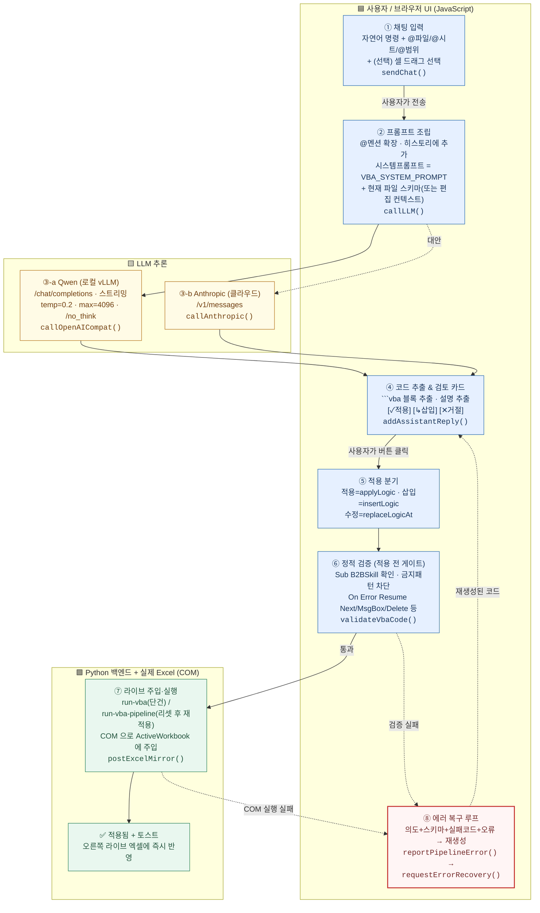

# GPT 도식화용 프롬프트 — "채팅 → VBA 생성 → 엑셀 적용" 전체 로직

아래 블록 전체를 복사해서 ChatGPT(또는 이미지/다이어그램 생성 도구)에 붙여넣으면,
이 앱이 사용자의 채팅 명령을 받아 VBA를 만들고 실제 엑셀에 적용하기까지의 흐름을
그림으로 그릴 수 있습니다.

---

## (여기부터 복사) ───────────────────────────────────────────────

너는 시스템 아키텍처 다이어그램을 그려주는 도우미야.
아래에 설명하는 시스템의 **end-to-end 흐름도(flowchart)** 를 한 장의 그림으로 그려줘.

### 그림 요구사항
- 위에서 아래로 흐르는 세로 플로우차트. 단계마다 번호(①~⑧)를 붙여줘.
- 각 단계는 둥근 사각형 박스. 박스 안에는 "무슨 일이 일어나는지"를 한국어로 짧게.
- 핵심 함수명/파일명은 박스 하단에 작은 글씨(monospace)로 같이 표기.
- 세 종류의 화살표를 색으로 구분:
  - **검정 실선** = 정상 흐름(성공 경로)
  - **빨강 점선** = 실패/오류 시 흐름(에러 복구 루프)
  - **파랑 실선** = 사람(사용자)의 행동(입력, 버튼 클릭)
- 다음 3개는 별도 색 영역(스윔레인 또는 배경색)으로 묶어줘:
  - 🟦 **프런트엔드(브라우저 UI / JavaScript)**
  - 🟨 **LLM(모델 추론)**  — 여기 안에 Qwen(로컬)과 Anthropic(클라우드) 두 갈래 표시
  - 🟩 **백엔드(Python) + 실제 Excel(COM)**
- "멀티턴 대화", "정적 검증", "에러 복구 루프"는 눈에 띄게 강조(예: 굵은 테두리/주석 말풍선).

### 그릴 시스템 설명 (이대로 단계화해서 그려줘)

이 앱은 사용자가 **채팅창에 자연어로 명령**하면, LLM이 **엑셀 VBA 매크로(`Sub B2BSkill()`)** 를
생성하고, 그 매크로가 **사용자가 보고 있는 실제 Excel 워크북에 즉시 주입·실행**되는 구조다.
"리모콘 모델"이라고 부른다 — 채팅으로 옆에 떠 있는 엑셀을 원격 조종하는 느낌.

핵심 성격:
- **멀티턴 대화**다. 직전까지의 대화(최근 18개 메시지 / 약 32,000자)가 매 요청에 함께 전달돼서,
  이전 맥락을 이어 명령할 수 있다. (단, 시스템 프롬프트는 "이번 요청 하나만 수행하라"고 못박아
  과거 작업을 반복하지 않게 한다.)
- 생성된 코드는 **자동 적용이 아니다.** 사용자가 [✓ 적용] / [↳ 삽입] / [✕ 거절] 버튼을 눌러야
  엑셀에 반영된다. 수정 모드면 [✓ 수정 적용] / [✕ 거절].
- 적용 직전에 **정적 검증**으로 위험 패턴을 차단하고, 실패하면 **에러 복구 루프**로 다시 만든다.

──────────────────────────────────────────────

**① 사용자 입력 (파랑/사람)**
- 사용자가 채팅창에 자연어 명령을 친다. 예: "B열부터 D열까지 숨겨줘", "요약 시트 B2에 총매출 써줘".
- 선택적으로 `@파일`, `@시트`, `@범위` 로 대상을 콕 집거나, 엑셀 미러에서 셀을 드래그해 선택해 둘 수 있다.
- "수정 모드"면 기존에 만들어진 특정 단계(Step)를 고쳐달라는 요청이 된다.
- 함수: `sendChat()`  (scripts/chat-ui.js)

**② 프롬프트 조립 (프런트엔드 🟦)**
- 사용자가 쓴 `@멘션`을 실제 파일/시트/범위 설명으로 확장한다. `augmentUserPromptWithMentions()`
- 이번 사용자 메시지를 **대화 히스토리에 추가**한다. (`state.chatHistory`)
- **시스템 프롬프트**를 만든다:
  - VBA 엔진이면 → `VBA_SYSTEM_PROMPT`(숨김≠삭제, 대상 시트/셀만 한정, 수식/서식/병합 보존,
    On Error Resume Next·MsgBox 금지, 실패 시 Err.Raise 등 규칙) **+ 현재 열려있는 파일들의 스키마 요약**.
  - 수정 모드면 → 스키마 대신 **현재 고치는 코드 + 편집 컨텍스트**(`buildEditingContext()`)를 붙인다.
- 함수: `callLLM()`  (scripts/llm-api.js), 히스토리: `getLLMChatHistory()` (최근 18메시지/32,000자 컷)

**③ LLM 생성 (모델 🟨)** — 두 갈래로 그려줘
- (기본) **Qwen** 로컬 vLLM: openai-compat `/chat/completions`, 스트리밍, temperature=0.2,
  max_tokens=4096, think 끔(`/no_think`). `callOpenAICompat()`
- (대안) **Anthropic** 클라우드: `/v1/messages`. `callAnthropic()`
- 응답이 토큰 단위로 화면에 흘러나오고(스트리밍), 완성되면 **어시스턴트 답변도 히스토리에 추가**된다.
- 출력 형식: 짧은 설명 + ```vba 코드블록 하나(그 안에 `Sub B2BSkill() … End Sub`).

**④ 코드 추출 & 검토 UI (프런트엔드 🟦)**
- 응답에서 ```코드블록을 꺼내고(`extractCode()`), 언어를 판별(`inferCodeLanguage()` → vba),
  한 줄 설명을 뽑는다(`extractDescription()`).
- 채팅에 코드 카드 + 액션 버튼을 보여준다:
  - 신규: **[✓ 적용] [↳ 삽입] [✕ 거절]**
  - 수정 모드: **[✓ 수정 적용] [✕ 거절]**
- 함수: `addAssistantReply()`  (scripts/chat-ui.js)
- ※ 여기서 사용자가 버튼을 눌러야 다음으로 간다(파랑/사람 화살표).

**⑤ 적용 분기 (프런트엔드 🟦)**
- [✓ 적용] → `applyLogic()` : 파이프라인 맨 뒤에 새 단계로 추가.
- [↳ 삽입] → `insertLogic(step, 위치)` : 원하는 순번에 끼워넣음(순서가 바뀜).
- [✓ 수정 적용] → `replaceLogicAt(stepId, ...)` : 기존 단계의 코드를 교체.

**⑥ 정적 검증 — 적용 전 안전 게이트 (프런트엔드 🟦, 굵게 강조)**
- `assertValidVbaStep()` → `validateVbaCode()` 가 **실행 전에** 금지/위험 패턴을 검사:
  - 진입점 `Sub B2BSkill()` / `End Sub` 존재?
  - 금지: On Error Resume Next, MsgBox/InputBox, Shell, Workbooks.Open, Save/SaveAs/Close,
    Application.Quit, 시트 전체 Clear, 행/열 대량 Delete, ActiveCell.Offset, 허용 안 된 CreateObject,
    (요청에 '전체 시트' 의도가 없는데) 모든 Worksheets 순회 등.
- **통과하면 ⑦로**, **실패하면 throw → ⑧ 에러 경로(빨강)** 로 빠진다.

**⑦ 라이브 엑셀 주입·실행 (백엔드 Python + Excel COM 🟩)**
- VBA 엔진 + 라이브 세션이면:
  - 단건 추가 → `applyVbaStepToLiveExcel()` → 백엔드 `POST /api/excel/run-vba` (그 코드 1개 주입)
  - 삽입/수정/순서변경 → `reapplyVbaPipelineToLive()` → 라이브 워크북을 원래 상태로 **리셋한 뒤
    enabled 단계들을 처음부터 순서대로 재적용** → `POST /api/excel/run-vba-pipeline`
- 통신 함수: `postExcelMirror()` (scripts/excel-mirror.js).
- **Python 백엔드가 COM 으로 사용자가 보고 있는 ActiveWorkbook 에 매크로를 주입하고 즉시 실행**한다.
  결과가 오른쪽 라이브 엑셀 화면에 바로 보인다.
- 성공 → 단계 상태가 "적용됨"으로 바뀌고 토스트 알림. (정상 흐름 끝)

**⑧ 실패 시 — 에러 복구 루프 (빨강 점선, 굵게 강조)**
- ⑥ 정적 검증 실패 또는 ⑦ COM 실행 실패면 `reportPipelineError()` 가 채팅에
  "스킬을 적용하지 못했습니다" + **[에러 복구 시도]** 버튼을 띄운다.
- 사용자가 누르면(또는 자동) `requestErrorRecovery()` 가
  **{사용자 의도 + 현재 파일 스키마 + 실패한 코드 + 오류 메시지}** 를 모델에 다시 줘서
  같은 의도를 만족하는 VBA를 **다시 생성**한다 → 다시 ④ 검토 → ⑤ 적용 → ⑥ 검증 …
- 즉 **생성 → 검증 → (실패 시) 사유 기반 재작성** 이 루프를 이룬다. 이 그림의 핵심 포인트로 강조해줘.

──────────────────────────────────────────────

마지막으로 그림 우측이나 하단에 작은 범례(legend)를 넣어줘:
- 검정 실선 = 정상 흐름 / 빨강 점선 = 실패·복구 / 파랑 = 사용자 행동
- 🟦 브라우저(JS) / 🟨 LLM 추론 / 🟩 Python 백엔드+Excel COM
- 강조 박스 3개: "멀티턴 대화 맥락", "적용 전 정적 검증", "실패 사유 기반 에러 복구 루프"

가능하면 Mermaid `flowchart TD` 코드로도 같이 출력해줘(내가 직접 렌더링할 수 있게).

## ───────────────────────────────────────────── (여기까지 복사)

---

## 부록 — 이미 Mermaid 로 그려본 버전 (참고용, 위 프롬프트 없이 바로 봐도 됨)



> 강조 3대 포인트
> 1. **멀티턴 대화** — 최근 18메시지/32,000자가 매 요청에 함께 전달(②), 단 "이번 요청만 수행" 규칙으로 과거작업 반복 방지.
> 2. **적용 전 정적 검증**(⑥) — 위험 VBA는 엑셀에 닿기 전에 차단.
> 3. **실패 사유 기반 에러 복구 루프**(⑧) — 생성→검증→(실패)재작성이 순환.
